## What?

* Advanced Intro to boost graph library
* Intro to CGAL
* Useful c++ stuff
* Debugging on Code Expert
* Common Pitfalls and Further Things You Should Know

You might want to download this file and view it in Typora, so that you have a nice table of contents in the sidebar.

## Why?

The Algolab Lecture at ETH aims to teach you how to put some algorithmic building blocks together and to deal with intentionally confusing exercise statements.
The exercises they provide are great, but the guidance less so.

I have especially found the tutorial sessions on what the libraries we are supposed to use offer and how to use them quite lacking. Since I haven't found many good comprehensive resources for boost beginners out there, I have kept track of my own progress.

> "You don't need to understand that, you can copy paste it from the provided example codes during the exam."

## How?

The intended audience are master students taking the Algorithms Lab course. I am assuming generic coding skills similar to the ones I had at the start of the semester.

I originally planned to go through all my notes again and write them up in better words and more detail, but I think I won't be doing that. See the file `codingtricks.md` for my raw notes that cover more than just the basics in the sections below.

I think everything I wrote here is valuable, but there are some parts that go deeper into detail than you might care for now. Just skim them and then read it when you need it :)

# How To Boost

The [boost](https://boost.org) library offers various algorithms that are already implemented and you only need to pick and combine. It is very useful to be aware that there is a [BGL table of contents](https://www.boost.org/doc/libs/1_75_0/libs/graph/doc/table_of_contents.html) which is available during the exam.

It's important to know what they already have, so you don't end up implementing dijstra's shortest path algorithm yourself... again.

If you like videos, there's a [good one here](https://www.youtube.com/watch?v=GSp2531Wti4) that covers the basics.

## Algorithms

Some algorithms you should know exist follow. I'll get to how to use them later.

* Maximum Flow and Matching Algorithms
  1. [`edmonds_karp_max_flow`](https://www.boost.org/doc/libs/1_75_0/libs/graph/doc/edmonds_karp_max_flow.html)
  2. [`push_relabel_max_flow`](https://www.boost.org/doc/libs/1_75_0/libs/graph/doc/push_relabel_max_flow.html)
  3. [`edmonds_maximum_cardinality_matching`](https://www.boost.org/doc/libs/1_75_0/libs/graph/doc/maximum_matching.html)
  4. [`maximum_weighted_matching`](https://www.boost.org/doc/libs/1_75_0/libs/graph/doc/maximum_weighted_matching.html)
* Minimum Spanning Tree Algorithms
  1. [`kruskal_minimum_spanning_tree`](https://www.boost.org/doc/libs/1_75_0/libs/graph/doc/kruskal_min_spanning_tree.html)
  2. [`prim_minimum_spanning_tree`](https://www.boost.org/doc/libs/1_75_0/libs/graph/doc/prim_minimum_spanning_tree.html)
* Minimum Cost Maximum Flow Algorithms
  1. [`cycle_canceling`](https://www.boost.org/doc/libs/1_75_0/libs/graph/doc/cycle_canceling.html)
  2. [`successive_shortest_path_nonnegative_weights`](https://www.boost.org/doc/libs/1_75_0/libs/graph/doc/successive_shortest_path_nonnegative_weights.html)
* Connected Components Algorithms
  1. [`connected_components`](https://www.boost.org/doc/libs/1_75_0/libs/graph/doc/connected_components.html)
  2. [`strong_components`](https://www.boost.org/doc/libs/1_75_0/libs/graph/doc/strong_components.html)
  3. [`biconnected_components`](https://www.boost.org/doc/libs/1_75_0/libs/graph/doc/biconnected_components.html)
  4. [`articulation_points`](https://www.boost.org/doc/libs/1_75_0/libs/graph/doc/biconnected_components.html#sec:articulation_points)
* [`dijkstra_shortest_paths`](https://www.boost.org/doc/libs/1_75_0/libs/graph/doc/dijkstra_shortest_paths.html)

## Building A Graph

There are different graph types, but for Algolab you will use the same one almost always: [adjacency_list](https://www.boost.org/doc/libs/1_75_0/libs/graph/doc/using_adjacency_list.html) with underlying storage `boost::vecS` for the Vertex List and Edge List.

There is also the option of using an `adjacency_matrix` instead of an `adjacency_list` but I have actually never done that during the whole course.

The type of the Graph looks somewhat scary when you're not used to it:

```c++
typedef boost::adjacency_list<
               boost::vecS,
               boost::vecS,
			   boost::undirectedS> graph_t;
```

The options for the underlying types of the Edge List and Vertex List are the first two template arguments. They have an effect on speed, memory consumption, and on which operations break the iterators over vertices or edges. On [this page](https://www.boost.org/doc/libs/1_58_0/libs/graph/doc/adjacency_list.html) you can find a table that tells you more on that. Some facts that I found somewhere:

* If you don't want parallel edges (two edges with the same source and target) you could use a `setS` or `hash_setS` type for the Edge List. If you don't care, use a sequence based type like `listS`, `vecS`, or `slistS` because `add_edge()` is faster there.
  However, finding an edge is faster in AssociativeContainers and hence clearing a vertex also is.

* The iterator over edges is fastest with `vecS` and slowest with `hash_setS`.

* My notes say

  > Use `listS`for VertexList  (the second type argument). It uses more space than `vecS` but is constant time instead of `O(V+E)` for `remove_vertex()` and it does not cause invalidation of vertex descriptors on deletion.

  although looking back, I think I never heeded my own advice and just used `vecS`for everything.

### Directedness

A graph is either `directedS`, `undirectedS`, or `bidirectionalS`. The last one stores all the information twice. Only in that last case can you get the *incoming* edges of a vertex. But you don't need that often.

### Weights / Internal Properties

Some algorithms work with special properties like "Vertex Color" or "Edge Weight" etc. The simplest way to make them work is by using a predefined type in the graph typedef to tell boost that we need a graph with that property. For example, let's try run [kruskal's algorithm](https://www.boost.org/doc/libs/1_75_0/libs/graph/doc/kruskal_min_spanning_tree.html) for building a minimum spanning tree.

For this we make use of some (optional) template arguments that come after the ones I've already mentioned.

```c++
typedef boost::adjacency_list<
               boost::vecS,
               boost::vecS, boost::undirectedS,
               boost::no_property,
               boost::property<boost::edge_weight_t, int> 
            	> weighted_graph_t;
```

We define the `Vertex Property` to be unset by specifying `boost::no_property` because we don't care about that. And for the edges, we want a weight.

Note that this snippet uses `int` as a type for the edge weight. But sometimes we need a larger type. There's no problem in changing this to a `long`!

The `boost::property` syntax here seems unneccessary bloat at first, but once we would like to have more than just one property associated with the Edge, it makes sense: The `boost::property` actually takes three template arguments if you give it three. The first is the kind of property (`edge_weight_t` here), the second is the type of that property's value (`int` here) and the third, which I have not yet shown, is... *another property*. That's right, template recursion!

We could then start nesting them like this:

```c++
typedef boost::adjacency_list<boost::vecS, boost::vecS, boost::directedS, boost::no_property,
  boost::property<boost::edge_capacity_t, long,
    boost::property<boost::edge_residual_capacity_t, long,
      boost::property<boost::edge_reverse_t,
                      traits::edge_descriptor>>>> graph_t;
```

But you shouldn't have to worry too much about writing these yourself. The spirit of Algolab is to copy-paste such examples from the slides or the code examples.

Once you have built a graph with such internal properties as required by the function you want to call, you can call it quite simply and it will automatically use these properties. For example after a quick look at the [kruskal](https://stackoverflow.com/a/56124666/2550406) docs, I add the include from "Where Defined" and call it like this:

```c++
#include <boost/graph/kruskal_min_spanning_tree.hpp>
// [Graph Type Definition Here]

// now inside some function:
boost::kruskal_minimum_spanning_tree ( 
    G /* our graph */,
    out_it /* where it should write the output to */ )
```

But we don't know yet what that `out_it` is supposed to be. More on that in the section on [calling kruskal](#calling-kruskal) below.

### Inserting Vertices

When you have your typedef the way you want it, it's quite easy to instantiate a graph variable of that type with a given number of vertices.

```c++
int main(){
    graph_t G(100);
    return 0;
}
```

Every vertex is identified by some vertex handle. The type for that can be typedef'd e.g. with

```c++
typedef boost::graph_traits<graph_t>::vertex_descriptor          vertex_desc;
```

but in practise as long as your underlying types are always `vecS`, these are actually just integer values. Makes sense, because the vertices are stored in a vector, right?

When you delete a vertex from the graph, all the vertices after that one are shifted around, so deleting a vertex can invalidate your vertex descriptor. The solution for algolab is to just not do that.

### Inserting Edges

```c++
int n = 100;
graph_t G(n);
// add an edge from vertex 0 to vertex 4
boost::add_edge(0, 4, G);
// adding an edge automatically adds the vertex if necessary. 
// But why would you not set the correct graph size from the start?
boost::add_edge(0, 150, G);
```

> ```
> std::pair<edge_descriptor, bool>
> add_edge(vertex_descriptor u, vertex_descriptor v,
>          adjacency_list& g)
> ```
>
> Adds edge *(u,v)* to the graph and returns the edge descriptor for the new edge. For graphs that do not allow parallel edges, if the edge is already in the graph then a duplicate will not be added and the `bool` flag will be `false`. When the flag is `false`, the returned edge descriptor points to the already existing edge.

The `add_edge` function returns an edge descriptor. That allows us to later access that edge. For example if we want to modify its weight.

If we have our weighted graph again, with only one edge property, then we can set that property right when adding the edge.

```c++
boost::add_edge(u, v, weight, G);
```

Other times, when we have many properties per edge, I find it easier to do it in a different way. We can kindly ask boost to give us a "property map" which we can then use to look up a specific property for an edge descriptor.

```c++
// type of edge descriptor
typedef boost::graph_traits<graph_t>::edge_descriptor          edge_desc;
// ...
auto weight_map = boost::get(boost::edge_weight, G);
// Note how we get the property map for edge_weight,
// not for edge_weight_t. Because the _t was only in the typedefs

auto edge_one_pair = boost::add_edge(0, 1, G);
auto edge_two_pair = boost::add_edge(2, 2, G);
// these are pairs of an edge descriptor and a boolean
// but "auto" can save you a lot of typing and confusion

// set weight to 12 for the first edge
edge_desc e1 = edge_one_pair.first;
weight_map[e1] = 12;
```

### Custom (Bundled) Properties

Sometimes we want to store additional information with an edge or a vertex. For example some `id` or whether we have already visited that vertex/edge.

The simplest way to do that is to specify a struct or class as the last of the recursive properties:

```c++
typedef struct {
    uint id;
} EdgeData;

class VertexData {
	public:
    	bool visited;
};

typedef boost::adjacency_list<boost::vecS, boost::vecS,
			boost::undirectedS,
	        VertexData,
			boost::property<
                boost::edge_weight_t, uint, EdgeData>
                >
  weighted_graph;
```

Then, we can access these values using the very simple syntax

```c++
G[my_vertex_descriptor].visited = true;
uint value = G[my_edge_descriptor].id;
```

See also [here](https://stackoverflow.com/questions/31540115/boost-graph-getting-adjacent-vertices) and [here](https://stackoverflow.com/a/47573336/2550406) on stackoverflow.

### Iterating

There are functions to get all incoming edges, all outgoing edges, all neighbouring vertices, all vertices, and so on. All of these give you the descriptors you need for accessing such things.

When you have an edge, you can get the vertices it connects with `boost::source(edge, G)` and `boost::target(edge, G)`.

One way to iterate over all outgoing edges from a vertex (you can also use this on an undirected graph):

```c++
auto it_pair = boost::out_edges(my_vertex_desc, G);
for ( auto it = it_pair.first; it != it_pair.second; it++){
    // do stuff until it_pair.first has reached the
    // end which is stored in it_pair.second
}
```

I've come to prefer this alternative way:

```c++
#include <boost/range/iterator_range.hpp>
for ( auto it : boost::make_iterator_range(boost::out_edges(my_vertex_desc, G))){
    // do stuff
}
```

I can't tell you why I prefer that, though. Probably because there are fewer ways to mess this one up.

### Graph `add_edge` with properties

`boost::add_edge(from, to, propertyvalue, graph)` where `propertyvalue` is [optional](https://clickhouse.tech/codebrowser/html_report/ClickHouse/contrib/boost/boost/graph/detail/adjacency_list.hpp.html#_ZN5boost8add_edgeENT_17vertex_descriptorES1_RKNS0_18edge_property_typeERNS_21directed_graph_helperIS0_EE). So if the EdgeProperty in the graph typedef is a struct, it can be created and passed there. If it is an integer like `boost::edge_weight_t` then it can be directly passed. For composite properties it must be composite as well.

Alternatively, simply first add the edge and then set the properties by using the various property maps and the edge descriptor.  You get the edge descriptor from the pair that is returned by `add_edge`:

> ```
> std::pair<edge_descriptor, bool>
> add_edge(vertex_descriptor u, vertex_descriptor v,
>          adjacency_list& g)
> ```
>
> Adds edge *(u,v)* to the graph and returns the edge descriptor for the new edge. For graphs that do not allow parallel edges, if the edge is already in the graph then a duplicate will not be added and the `bool` flag will be `false`. When the flag is `false`, the returned edge descriptor points to the already existing edge.
>
> The placement of the new edge in the out-edge list is in general unspecified, though ordering of the out-edge list can be accomplished through the choice of `OutEdgeList`. If the `VertexList` selector is `vecS`, and if either vertex descriptor `u` or `v` (which are integers) has a value greater than the current number of vertices in the graph, the graph is enlarged so that the number of vertices is `std::max(u,v) + 1`.
>
> If the `OutEdgeList` selector is `vecS` then this operation will invalidate any `out_edge_iterator` for vertex *u*. This also applies if the `OutEdgeList` is a user-defined container that invalidates its iterators when `push(container, x)` is invoked (see Section [Customizing the Adjacency List Storage](https://www.boost.org/doc/libs/1_37_0/libs/graph/doc/using_adjacency_list.html#sec:custom-storage)). If the graph is also bidirectional then any `in_edge_iterator` for *v* is also invalidated. If instead the graph is undirected then any `out_edge_iterator` for *v* is also invalidated. If instead the graph is directed, then `add_edge()` also invalidates any `edge_iterator`.
>
> ------
>
> ```
> std::pair<edge_descriptor, bool>
> add_edge(vertex_descriptor u, vertex_descriptor v,
>          const EdgeProperties& p,
>          adjacency_list& g)
> ```
>
> Adds edge *(u,v)* to the graph and attaches `p` as the value of the edge's internal property storage. Also see the previous `add_edge()` member function for more details.


I think the [property constructor](https://www.boost.org/doc/libs/1_60_0/libs/graph/doc/property.html)`property(const T& v, const NextProperty& b);` accepts nested properties similarly to the typedef. 

On that note, for the graph EdgeProperty typedefs, the predefined tags are, also from that link:

```c++
The following property tags are defined in boost/graph/properties.hpp.
  namespace boost {
    enum edge_name_t { edge_name }; 
    enum edge_weight_t { edge_weight }; 
    enum edge_index_t { edge_index };
    enum edge_capacity_t { edge_capacity }; 
    enum edge_residual_capacity_t { edge_residual_capacity }; 
    enum edge_reverse_t { edge_reverse }; 
    enum vertex_name_t { vertex_name }; 
    enum vertex_distance_t { vertex_distance }; 
    enum vertex_index_t { vertex_index };
    enum vertex_color_t { vertex_color }; 
    enum vertex_degree_t { vertex_degree }; 
    enum vertex_out_degree_t { vertex_out_degree }; 
    enum vertex_in_degree_t { vertex_in_degree }; 
    enum vertex_discover_time_t { vertex_discover_time }; 
    enum vertex_finish_time_t { vertex_finish_time }; 
    enum graph_name_t { graph_name };
        
    BOOST_INSTALL_PROPERTY(vertex, index);
    BOOST_INSTALL_PROPERTY(edge, index);
    // ...
  }
```


## Calling

You know now how to build a graph using internal properties. They will automatically be used when you call a BGL function like [`kruskal_minimum_spanning_tree`](https://www.boost.org/doc/libs/1_75_0/libs/graph/doc/kruskal_min_spanning_tree.html). But what about the other arguments?

The first argument is the graph, the second is an Output Iterator according to the docs, so ignoring all the optional parameters we could call it like this:

```c++
std::vector<edge_desc> mst;
boost::kruskal_minimum_spanning_tree(G, std::back_inserter(mst));
```

### Named Parameters

Many boost functions have in their declaration an optional parameter of type`bgl_named_params`:

```c++
template <  class Graph, class OutputIterator,
			class P, class T, class R >  OutputIterator

kruskal_minimum_spanning_tree(
    Graph& g, OutputIterator tree_edges,
    const bgl_named_params<P, T, R>& params = all defaults);
```

You can ignore that option if you want to.

What they do is outlined further down in the docs and they either specify `IN` (allow you to give additional inputs) or `OUT` (allow you to read additional outputs) or `UTIL`(used internally).

For example you might want to get a distance map from [Prim's algorithm](https://www.boost.org/doc/libs/1_75_0/libs/graph/doc/prim_minimum_spanning_tree.html) so that you know the weight of the edges in the MST. That is supposed to be a Property Map that hands you the distance from a given vertex to its direct parent in the MST. We can create such a map in multiple ways - see below. Or perhaps you want to tell Prim's algorithm where to start at, using the named parameter `root_vertex` that is also documented on that page.

You can do that like this:

```c++
std::vector<vertex_desc> pred_map(n);
auto p = boost::make_iterator_property_map(pred_map.begin(),
                                           boost::get(boost::vertex_index, G));
/*std::vector<int> distmap(n);
        auto d = boost::make_iterator_property_map(distmap.begin(),
                boost::get(boost::vertex_index, G));*/
boost::prim_minimum_spanning_tree(G, p,                      boost::root_vertex(tat)/*.distance_map(d)*/);
```

The commented-out part shows you how to use more than one named parameter.

### Custom Property Map (Vector)

```c++
#include <boost/property_map/property_map.hpp>
auto propmap = boost::make_iterator_property_map(myvec.begin(), boost::get(boost::vertex_index, G));
```

Writing to the newly created property map with the vertex as index will first look up the vertex in the second argument and because we specified a property map there that retrieves the `vertex_index`, it looks up the `vertex_index`. With `vecS` as vertex list in the graph, the `vertex_index` of a graph is often simply the `vertex_descriptor` but this here is how it's done correctly.

Then that index is used to perform an access to the vector `myvec` at that index. So modifying `propmap` will modify the vector.

Note: This would not work with edges that easily. Because edges don't have an `edge_index` by default. You would have to add that `boost::edge_index_t` property in the graph typedef and also set them yourself for each edge you add. Then you could use the same concept.

### Custom Property Map (Lambda)

```c++
// https://stackoverflow.com/questions/26979585/is-it-possible-to-have-several-edge-weight-property-maps-for-one-graph
// You can compose a property map in various ways. The simplest approach would seem something like:

#include <boost/property_map/function_property_map.hpp>
auto wmap1 = make_function_property_map<unsigned, float>([&weight_data](unsigned vertex_id) { return weight_data.at(vertex_id).weight1; });
```

We can even use it for writing to! E.g. with a vector backing it as storage:

```c++
std::vector<unsigned long> compmap(mbridges); // storage

// iterator property map (alternative)
auto propmap = boost::make_iterator_property_map(
    compmap.begin(), boost::get(boost::edge_index, OG));

// function property map
auto funmap = boost::make_function_property_map<edge_desc, unsigned long&>(
         [&OG, &compmap](edge_desc edge)->unsigned long&{
             // use edge_id as index in vector and return writeable reference
             size_t index = boost::get(boost::edge_index, OG)[edge];
                    return compmap[index];
                });
// use the map
unsigned long nbc = boost::biconnected_components(OG, funmap /* could also use propmap here */);

```

The second template argument is not necessary, because it can be inferred from the return type of the lambda. The lambda must have a return type that is a non-const reference, otherwise it cannot be written to - only read - and hence is not an lvalue. Final note: the lambda does not use an `&` in the return statement.

### Many Weight Maps for same Graph

use an edge property struct that defines some `id` for edges so you can get a hashable key from a given edge descriptor. Then store your things in an ordinary `unordered_map` and when an algorithm wants a weight map, provide it as 

```c++
auto wmap = boost::make_function_property_map<edge_desc, int> (
                    [&weight_storage, i, &G](edge_desc e){
                        uint edge_id = G[e].id;
                        return weight_storage[i][edge_id];
                    });

```

where `weight_storage[i]` is your map.

Reminder: specify the edge properties as third template argument of `boost::property` if you are using builtin properties as well:

```c++
typedef struct {
    uint id;
} EdgeData;

typedef boost::adjacency_list<boost::vecS, boost::vecS, boost::undirectedS,
        boost::vertex_distance_t, boost::property<boost::edge_weight_t, uint, EdgeData> >      weighted_graph;
```

### Filtered Graph

Allows you to filter the graph without copying it. Except that this is usually slow, because the predicates will be potentially executed every time an edge is accessed. So in the end I just used this for simpler graph copying.

This can also be useful when giving a graph to a visitor to operate on, but that is more complexity than I hope you will need during the exam.

[Example of DFS on MST](https://stackoverflow.com/a/49429372/2550406) uses `boost::keep_all` to keep all vertices in the filtered graph but only some edges.

> I just want to comment on one API "limitation" of filtered_graphs. `num_vertices(filtered_graph)` and `num_edges(filtered_graph)` will return the num of nodes and edges of the original graph. You would need to use `boost::vertices(filtered_graph)` and `boost::nodes(filtered_graph)` and count them to get the right value

If you're using a filtered graph in another algo, it might be [faster](https://stackoverflow.com/a/35570685/2550406) to just copy it.
The boost docs on [filtered_graph](https://www.boost.org/doc/libs/1_75_0/libs/graph/doc/filtered_graph.html) contain an example, so filtering graphs is actually possible to do during the exam with relative ease. Do note that you need their typedefs and prepend a few `boost::` at times.

#### Example by Me

```c++
typedef boost::adjacency_list<boost::vecS, boost::vecS, boost::undirectedS, boost::no_property,
        boost::property<boost::edge_weight_t, long> > bip_graph;
typedef boost::property_map<bip_graph, boost::edge_weight_t>::type EdgeWeightMap;

template <typename EdgeWeightMap>
struct positive_edge_weight { // misleading naming because why not
  positive_edge_weight() { }
  positive_edge_weight(EdgeWeightMap weight) : m_weight(weight) { }
  long dist = 0;
  template <typename Edge>
  bool operator()(const Edge& e) const {
    return get(m_weight, e) <= dist;
  }
  EdgeWeightMap m_weight;
};

// later: 
positive_edge_weight<EdgeWeightMap> filter(boost::get(boost::edge_weight, F));
filter.dist = time_allowed;
boost::filtered_graph<bip_graph, positive_edge_weight<EdgeWeightMap> >
    fg(F, filter);
bip_graph H; boost::copy_graph(fg, H);
```

#### Example with Struct (Vertices and Edges)

Code by [sehe](https://stackoverflow.com/a/45850742/2550406), CC-BY-SA

```c++
struct Predicate { // both edge and vertex
            bool operator()(Graph::edge_descriptor) const      { return true; } // all
            bool operator()(Graph::vertex_descriptor vd) const { return suppressed_->count((*g)[vd].label) == 0; }

            Graph* g;
            labels* suppressed_;
        } predicate {&g, &suppressed};

        using Filtered = boost::filtered_graph<Graph, Predicate, Predicate>;
        Filtered fg(g, predicate, predicate);
```

#### Example with Lambda

```c++
#include <boost/graph/filtered_graph.hpp>
auto myfilter = [&F, time_allowed](bip_edge_desc e){
    return boost::get(boost::edge_weight, F)[e] <= time_allowed; };
boost::filtered_graph<bip_graph, std::function<bool(bip_edge_desc)>> fg(F, myfilter);
bip_graph H; boost::copy_graph(fg, H);
```

Note that the explicit type of `std::function<bool(bip_edge_desc)>` as opposed to just using `decltype(myfilter)` is required because the latter is not default-constructible.

## Draw Graph For Debugging (Graphviz)

This allows you to generate output in `dot`. Which you can then render to an svg and view it in firefox (for example) like this:

```bash
dot -Tsvg -omygraph.svg mygraph.dot && firefox mygraph.svg
```

This works also in the exam environment. But I hope you won't need it.

[SO:](https://stackoverflow.com/questions/9181183/how-to-print-a-boost-graph-in-graphviz-with-one-of-the-properties-displayed)The correct way to get property map from your bundled properties is to use `boost::get`. So you can do something like:

```c++
#include <boost/graph/graphviz.hpp>
boost::write_graphviz(std::cout, your_graph,
    boost::make_label_writer(boost::get(&Vertex::name, your_graph)),
    boost::make_label_writer(boost::get(&Edge::weight, your_graph))
    );
```

Where `your_graph` is the graph object you have created.

Or to a file:

```c++
std::vector<std::string> NameVec; // vector of names
// write the dot file
std::ofstream dotfile (strDotFile.c_str ());
write_graphviz (dotfile, g, make_label_writer(&NameVec[0]));
```

[Or using dynamic properties](https://stackoverflow.com/a/60114442/2550406) for dot:

```c++
#include <boost/graph/graphviz.hpp>    
boost::dynamic_properties dp;
    dp.property("node_id", get(boost::vertex_index, g));
    dp.property("weight",  get(boost::edge_weight,  g));
    boost::write_graphviz_dp(std::cout, g, dp);
```

Note that there is no vertex_index if you're using `listS`. See further below under Combining A Bundle for the alternative way.

#### Combining a Bundle

```c++
dp.property("node_id", get(boost::vertex_index, g));
auto vbundle = get(boost::vertex_bundle, g);
dp.property("label", 
        boost::make_transform_value_property_map([](VertexClass const& vd) {
            return vd.get_id();
            }, vbundle));
```

#### or **simpler**:

```c++
#include<boost/graph/graphviz.hpp>
boost::dynamic_properties dp;
dp.property("node_id", get(boost::vertex_index, G));
dp.property("label", get(boost::edge_capacity, G));
write_graphviz_dp(std::cout, G, dp);
```

#### or with lambdas

```c++
#include <boost/graph/graphviz.hpp>
#include <boost/property_map/function_property_map.hpp>        
// visualize graph
boost::dynamic_properties dp;
dp.property("node_id", boost::make_function_property_map<vertex_desc, std::string>(
    [nts, nms](vertex_desc vid) {
        if (vid == 0) { return std::string("source"); } 
        if (vid == 1) { return std::string("sink"); }
        if (vid > 1 && vid < nts+2) { return "Station " + std::to_string(((int)vid)-2); }
        return "Agent " + std::to_string(((int)vid) - nts - 2);
    }));
dp.property("label", boost::make_function_property_map<edge_desc, std::string>(
    [MAX, &G](edge_desc eid) {
        unsigned long prio = MAX - boost::get(boost::edge_weight, G)[eid];
        unsigned long capa = boost::get(boost::edge_capacity, G)[eid];
        return "( c=" + std::to_string(capa) + ", p=" + std::to_string(prio) + ")";
    }));
std::ofstream fil("graph"+std::to_string(curr_test)+".dot");
boost::write_graphviz_dp(fil, G, dp);

```

#### Coloring

https://stackoverflow.com/a/48371770/2550406

## Boost Variant and Boost Any

[Docs](https://www.boost.org/doc/libs/1_75_0/doc/html/variant/misc.html#variant.versus-any) say that `boost::variant<Type1, Type2>` avoids dynamic allocation overhead and only allows specified types whereas `boost::any` allows any type and has not much template magic - avoiding compile-time processor and memory demands.

```c++
#include <boost/variant.hpp>
#include <boost/any.hpp>
```

## Disjoint Sets / Cluster Merging

[incremental components](https://www.boost.org/doc/libs/1_31_0/libs/graph/doc/incremental_components.html) and [disjoint sets](https://algolab.inf.ethz.ch/doc/boost/doc/libs/1_74_0/libs/graph/doc/disjoint_sets.html) (for doing cluster merges myself). Also see [disjoint sets with storage](https://github.com/chaehni/AlgoLab/blob/master/2019/week13/potw%20-%20revenge%20of%20the%20sith/src/algorithm.cpp#L38) which looks easier.
using it with just `int` as ids seems easiest, but we can also provide boost property maps for mapping to indexes and back. When used with ints, no mapping is required.
But need to track sizes of sets myself. And make sure to use new find_set after creating a merged set.

```c++ 
#include <boost/pending/disjoint_sets.hpp>
boost::disjoint_sets_with_storage<> uf(n); // initialized with n sets
uf.union_set(a, b); // union directly, using elements
uf.link(rep1, rep2); // union using representatives
int rep1 = uf.find_set(12); // getting representatives
```

### 

## Serializing a Graph

https://stackoverflow.com/a/28974945/2550406

## How To CGAL

There are mostly three things we do with that library:

* Delaunay Triangulations
* Linear Programs
* Something with geometry and exact number types.

### Delaunay

#### Store Info

Copy paste the code for the typedefs from the last slide of the Delaunay slides or from the emst example. Then adapt the includes and typedefs so you can store a struct with each Vertex and / or each Face:

```c++
#include <CGAL/Exact_predicates_inexact_constructions_kernel.h>
#include <CGAL/Exact_predicates_exact_constructions_kernel.h>
#include <CGAL/Delaunay_triangulation_2.h>
#include <CGAL/Triangulation_vertex_base_with_info_2.h>
#include <CGAL/Triangulation_face_base_with_info_2.h>
typedef CGAL::Exact_predicates_inexact_constructions_kernel K;
class VertexInfo{
    public:
        uint id;
};
class FaceInfo{};
// we want to store an index with each vertex
typedef CGAL::Triangulation_vertex_base_with_info_2<VertexInfo,K>   Vb;
typedef CGAL::Triangulation_face_base_with_info_2<FaceInfo,K>                     Fb;
typedef CGAL::Triangulation_data_structure_2<Vb,Fb>            Tds;
typedef CGAL::Delaunay_triangulation_2<K,Tds>                  Triangulation;
typedef Triangulation::Face_handle Fh;
typedef Triangulation::Vertex_handle Vh;
typedef K::Point_2 P;
```

#### Read Points

```c++
K::Point_2 p;
std::cin >> p;
```

This works. No need to first store both coordinates in ints.

#### Insert Points

There's a big speed difference between the different possibilities.

Ideally, you fill a vector `v` with all the points and let CGAL handle the ordering. (Instead of inserting one after the other. In that case you should maybe shuffle them to avoid adversarial inputs that decrease the runtime enormously!).

You [can](https://doc.cgal.org/latest/Triangulation_2/classCGAL_1_1Triangulation__2.html#ac5e9bc8adef80dc01a0b31c2d0234545) store the `VertexInfo` defined above with each Point in a Pair in the vector if you want to:

```c++
Triangulation tri;
std::vector<std::pair<Point_2, VertexInfo> > vec;
// [fill vec]
tri.insert(vec.begin(), vec.end());
```

#### Documentation

Relevant are

* [Delaunay_triangulation_2](https://doc.cgal.org/latest/Triangulation_2/classCGAL_1_1Delaunay__triangulation__2.html)
* In the sidebar a bit below it [Triangulation_2](https://doc.cgal.org/latest/Triangulation_2/classCGAL_1_1Triangulation__2.html). The Delaunay Triangulation has all those functions as well.
* [Triangulation_data_structure_2](https://doc.cgal.org/latest/TDS_2/classTriangulationDataStructure__2.html) with some weird concepts.

#### Faces

if you have a `Triangulation::Face_handle`, you can use the `->` operator to get the [neighbor](https://doc.cgal.org/latest/TDS_2/classTriangulationDataStructure__2_1_1Face.html#a096a50bd226daf09826eeacf54727f0e) face at an index between 0 and 2 (including).

That neighbour face at index $i$ is the one that is adjacent to edge $i$, which is opposite to the vertex $i$. You can get that [vertex](https://doc.cgal.org/latest/TDS_2/classTriangulationDataStructure__2_1_1Face.html#ac4d03671704cd164b279706a098fdf5e) handle with the index as well. `fh->vertex(1)`. Have a look at the `fh->cw()` and `fh->ccw()` method for juggling with those indices.

[circumcenter](https://doc.cgal.org/latest/Triangulation_2/classCGAL_1_1Triangulation__2.html#a4185c75ba2c5ec34181fdef8fa57401c) can be useful.

#### Locating

You should know the methods `locate()` and `nearest_vertex()`!

#### Edges

Edges are just a pair of a Face handle and an index. You can use `.first` and `.second` to get the face and the edge index $i$.

The triangulation has the method [mirror_edge](https://doc.cgal.org/latest/Triangulation_2/classCGAL_1_1Triangulation__2.html#ab97ce60b20674d0a7a4455e88c2eadb1) which gives you the same edge again, but from perspective of the neighbouring face.

tri.[segment](https://doc.cgal.org/latest/Triangulation_2/classCGAL_1_1Triangulation__2.html#a06f3967c92db0fe28368c31ff671c658) can be useful to compute the length if you don't want to use `CGAL::squared_distance` on the two endpoints for some reason.

#### Circulators

They are like iterators, but scary. E.g. `incident_faces` and `incident_vertices` are returning circulators.

* They can be null if you only have one Point in the triangulation
* They make it easy to do something wrong in the loop condition. Remember to increment them, always.
* They can give you something infinite.
* Use a `do...while` loop. *if* it is not null.
* Stop the loop once the circulator that you incremented is equal to the original circulator.

#### Slides

Some of the slides are very good for this topic! Definitely check them out, since they might have been updated for the latest version of CGAL.

### 

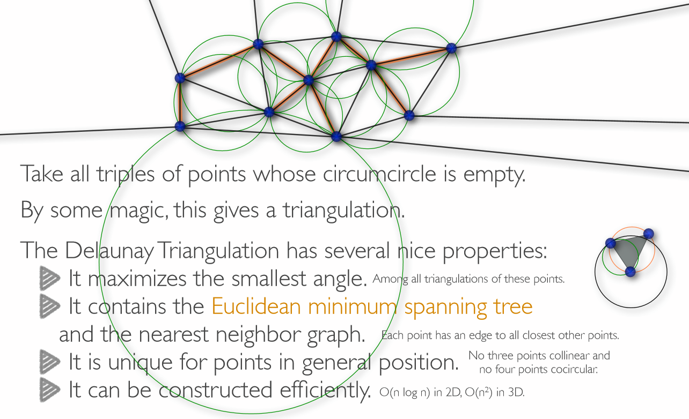

and query in `log (n)` where `n` are the already-stored points.

Note:

*  "each point has an edge to all closest other points".

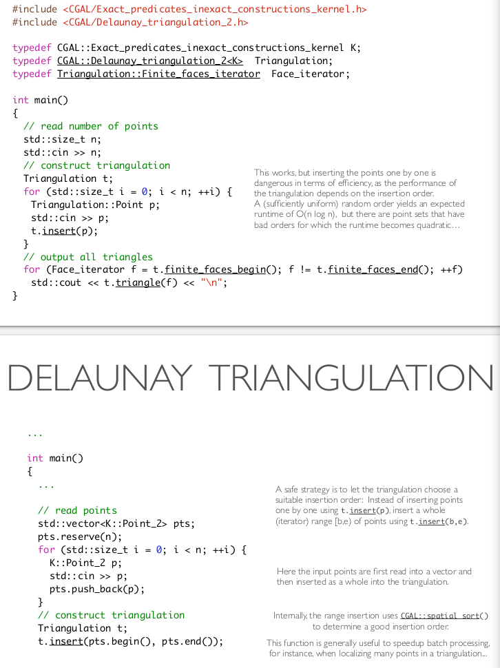

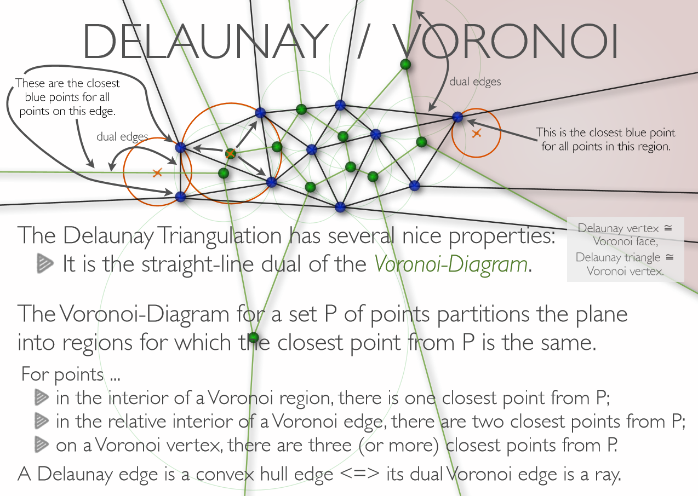

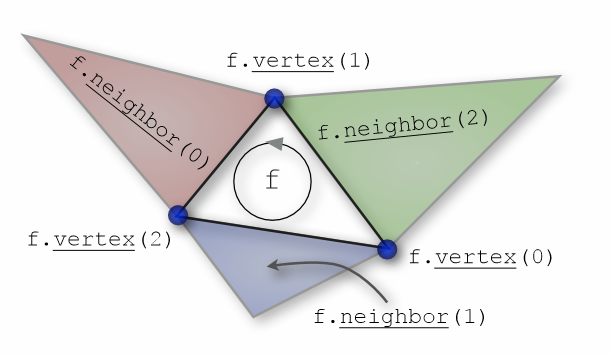

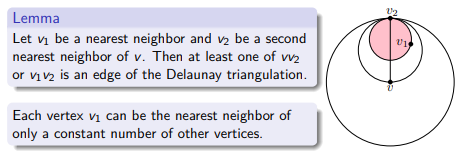

#### Build Graph from Delaunay

```c++
// construct triangulation
  Triangulation t;
  t.insert(points.begin(), points.end());
  
  // construct graph from the triangulation using only edges with distance <= r
  graph g(n);
  for (Triangulation::Finite_edges_iterator e = t.finite_edges_begin(); e != t.finite_edges_end(); ++e) {
    K::Segment_2 seg = t.segment(*e);
    K::Point_2 s = seg.source(), t = seg.target();
    if (CGAL::squared_distance(s, t) > r*r) continue;
    
    boost::add_edge(indices.at(s), indices.at(t), g);
  }
```

Do note however that sometimes you don't even need to build a new graph. You can simply traverse the delaunay graph directly.

#### Convex Hull

You can get the convex hull by looking at the neighbours of the infinite vertex.

>  

### 

### Linear Programs

I think the slides suffice on this. I will have some common pitfalls regarding this though.

Here are some good quotes from the slides:

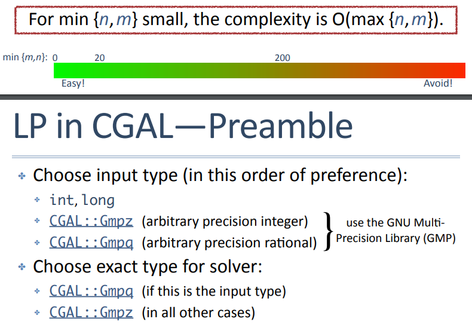

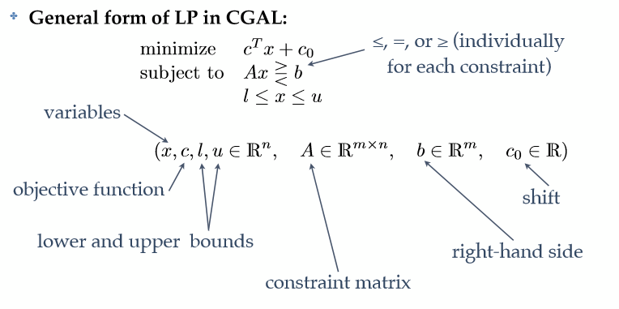


##### Pivot Rule

Use the default pivot rule unless it fails. If it fails, it cycles forever.

```c++
// slower but certain to avoid cycling:
CGAL::Quadratic_program_options options; options.set_pricing_strategy(CGAL::QP_BLAND); Solution s = CGAL::SOLVER(program, ET(), options);
```

##### Code

```c++
#include <CGAL/QP_models.h>
#include <CGAL/QP_functions.h>
#include <CGAL/Gmpz.h>
// choose input type (input coefficients must fit)
typedef int IT;
// choose exact type for solver (CGAL::Gmpz or CGAL::Gmpq)
typedef CGAL::Gmpz ET;

// program and solution types
typedef CGAL::Quadratic_program<IT> Program;
typedef CGAL::Quadratic_program_solution<ET> Solution;
```

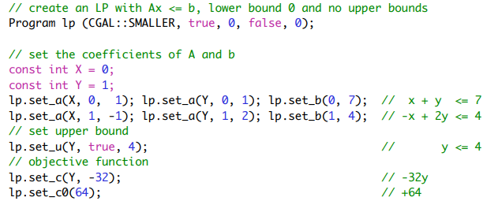

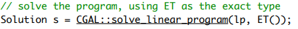

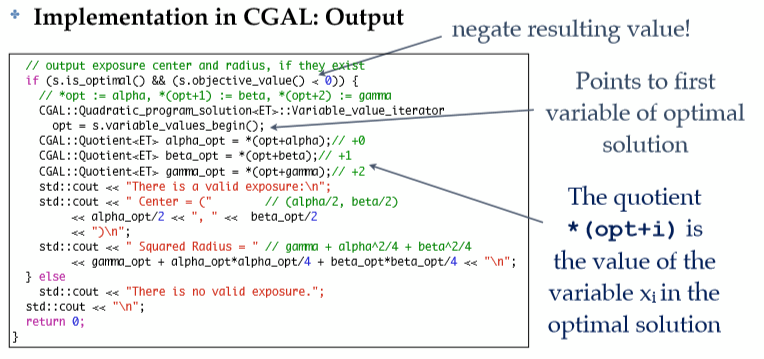

There is also a nonnegative linear solver `CGAL::solve_nonnegative_linear_program(lp, ET());` but it ignores all other lower and upper bounds set with `set_l` and `set_u`.

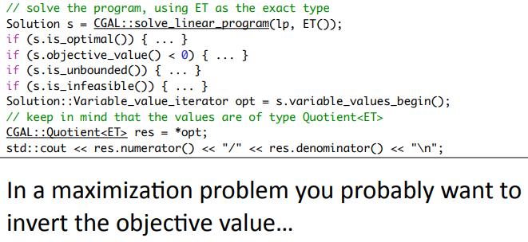

> Do not copy or assign objects of type CGAL::Quadra.c_program_solution
> (source is new slides. but CGAL [docs](https://doc.cgal.org/latest/QP_solver/classCGAL_1_1Quadratic__program__solution.html) say that works)

##### Too Slow?

* Use `QP_Bland` as per pivot rule to avoid cycles, although its generally slower. 
* If that doesn't help, maybe switch up your input types. `double` is faster than `int`, and `int` is faster than `K::FT`.

>  We use `int` as the input type, and `MP_Float` or `Gmpz` (which is faster and preferable if `GMP` is installed) as the exact type for the internal computations. In larger examples, it pays off to use `double` as input type in order to profit from the automatic floating-point filtering that takes place then.
>  [Source](

### Geometry

* Geometry is slow. So it can pay off to avoid constructions.
* Use the worst possible kernel, it's the fastest as well.
* Lower numbers are generally faster than higher numbers.
* To avoid using square root, just work with the squares.
* Don't construct intersections directly - first check if they actually intersect. That's faster.
* [Some helpful functions](https://doc.cgal.org/latest/Kernel_23/group__kernel__global__function.html)

### Varia

I don't think you really need that. But here it is.

#### Faces Iterator Range

CGAL Version 5 seems to have `for (Face_handle fh : triangulation.all_face_handles())`. The Version 4 I have in my docker locally does not support that though, so there I must do

```c++
for ( auto fit = tri.all_faces_begin(); fit != tri.all_faces_end(); fit++ ){
  Fh fh = fit;
```

but it should work in the exam environment.

#### CGAL Kernel Conversion

See the [Cartesian_converter](https://doc.cgal.org/latest/Kernel_23/classCGAL_1_1Cartesian__converter.html) and the example. I'm not sure if it requires some special  kernel field types as they are doing in the example or not. The [epec doc](https://doc.cgal.org/latest/Kernel_23/classCGAL_1_1Exact__predicates__exact__constructions__kernel.html) says that it uses cartesian representation however, so it probably works?

```c++
#include <CGAL/Simple_cartesian.h>
#include <CGAL/Quotient.h>
#include <CGAL/MP_Float.h>
#include <CGAL/Cartesian_converter.h>
typedef CGAL::Simple_cartesian<double>                           IK;
typedef CGAL::Simple_cartesian<CGAL::Quotient<CGAL::MP_Float> >  EK;
typedef CGAL::Cartesian_converter<IK,EK>                         IK_to_EK;
typedef CGAL::Cartesian_converter<EK,IK>                         EK_to_IK;
...
EK_to_IK to_inexact;
IK::Point_3 inexact_pt = to_inexact(exact_pt);
```

A different approach is [on github](https://github.com/CGAL/cgal/issues/1873#issuecomment-276306078) where they use it to convert from epec to epec_sqrt:

```c++
#include <CGAL/Exact_predicates_exact_constructions_kernel.h>
#include <CGAL/Exact_predicates_exact_constructions_kernel_with_sqrt.h>
#include <CGAL/Cartesian_converter.h>


struct Lazy_gmpq_to_Expr_converter
  : public std::unary_function< CGAL::Lazy_exact_nt<CGAL::Gmpq>, CORE::Expr >
{
    CORE::Expr
    operator()(const CGAL::Lazy_exact_nt<CGAL::Gmpq> &a) const
    {
      return ::CORE::BigRat(exact(a).mpq());
    }
};

CGAL::Cartesian_converter<CGAL::Epeck,
                          CGAL::Exact_predicates_exact_constructions_kernel_with_sqrt,
                          Lazy_gmpq_to_Expr_converter> to_sqrt_kernel;

int main()
{
  CGAL::Epeck::FT a;
  CGAL::Exact_predicates_exact_constructions_kernel_with_sqrt::FT b = to_sqrt_kernel(a);
  CGAL::Epeck::Point_3 c;
  CGAL::Exact_predicates_exact_constructions_kernel_with_sqrt::Point_3 d = to_sqrt_kernel(c);
}
```

> Note that I have hardcoded the number types of the Kernel (they might change if you do not use GMP).
> Also notice that calling `exact()` on a lazy (nt or geometric object) will trigger the exact computation.
>
> [...] It really depends on what you are doing. About the trigger the exact computation, if you do not have a lot of cascaded constructions that should not be problem.

#### k-th root and n-th power


https://doc.cgal.org/latest/Algebraic_foundations/classAlgebraicStructureTraits___1_1KthRoot.html

#### Printing A Triangulation

Search the [delaunay docs](https://doc.cgal.org/latest/Triangulation_2/classCGAL_1_1Triangulation__2.html#adf800f903a06c19d07d27afb2927fc71) for `i/o`  and for the `<<` operator to see the relevant information. Basically, it first prints the number of vertices and edges (plus the infinite ones) and then the dimension - should usually be 2. Then the coordinates of all points. Then the faces and some more info.

## C++

Random selection of sometimes useful facts that I didn't know before (or maybe I did). Some of these, I don't recommend using because a simpler approach is often more code but less mistake-prone. Make your own decisions.

Things like how to sort a `priority_queue` with a lambda function.

### Binomial Coefficient

```c++
#include <boost/math/special_functions/binomial.hpp>
# for computing n nCr k
```

### Print Vector / Set

```c++
#include <iomanip>
# Comma Separated output
std::copy(path.begin(), path.end(), 
          std::ostream_iterator<char>(std::cout, ", "));
```

### IO Speed

```c++
std::ios_base::sync_with_stdio(false);
```

### Initialize Vector of Vectors

Use the [`std::vector::vector(count, value)`](http://en.cppreference.com/w/cpp/container/vector/vector) constructor that accepts an initial size and a default value:

```cpp
std::vector<std::vector<int> > fog(
    A_NUMBER,
    std::vector<int>(OTHER_NUMBER)); // Defaults to zero initial value
```

If a value other than zero, say `4` for example, was required to be the default then:

```cpp
std::vector<std::vector<int> > fog(
    A_NUMBER,
    std::vector<int>(OTHER_NUMBER, 4));
```

See [my question](https://stackoverflow.com/questions/64004536/how-do-these-three-ways-of-creating-vectors-differ) for ways not to do it.

### Elementwise Sum of two vectors

```
#include <algorithm>
#include <functional>

template <typename T>
std::vector<T> operator+(const std::vector<T>& a, const std::vector<T>& b)
{
    assert(a.size() == b.size());

    std::vector<T> result;
    result.reserve(a.size());

    std::transform(a.begin(), a.end(), b.begin(), 
                   std::back_inserter(result), std::plus<T>());
    return result;
}
```

### Max Element of Vector

```c++
auto it = max_element(std::begin(cloud), std::end(cloud));
myval value = *it;
```

### Read Rest Of Line

https://stackoverflow.com/questions/63953373/how-to-ignore-the-rest-of-the-line

```#include <limits>
#include <limits>
cin.ignore(std::numeric_limits<std::streamsize>::max(), '\n');
```

### Comparators

If you have e.g. a `std::set`, it needs to know how to sort the contents. You can provide it with the function as a second template argument like I did in the following code snippet.

Personally, I vastly prefer using lambda functions for this, although that adds some complexity.

```c++
class Tracker {
    private:
        static bool cmp(Word a, Word b) { return a.word_id < b.word_id; }
    public:
        std::vector<std::set<Word, decltype(Tracker::cmp)*>> sets;
        std::vector<uint> interval_starts;
        std::vector<uint> interval_ends;
        std::vector<uint> interval_best;
        uint n;
        Tracker(uint n): n(n){
            // sets that are unique wrt to word id, not position
            for (uint i=0; i<n; i++){
                sets.push_back(std::set<Word, decltype(Tracker::cmp)*>(Tracker::cmp));
                interval_starts.push_back(0);
                interval_ends.push_back(UINT_MAX);
                interval_best.push_back(UINT_MAX);
            }
        }
```

If you want to use a lambda function here, you would have to assign it to `std::function<bool(Word,Word)>` instead of `auto` or alternatively pass it to the set's constructor as an argument:

```c++
auto cmp = [](Word& a, Word& b) { return a.word_id < b.word_id; };
std::set<Word, decltype(cmp)> myset (cmp);
```

### Sort Vector of Pointers

```cpp
bool comparePtrToNode(Node* a, Node* b) { return (*a < *b); }

std::sort(_children.begin(), _children.end(), comparePtrToNode);
```

this can also be done with a lambda function.

I like doing this when it would lead to mistakes if I were to move the original values around. E.g. when I need a list sorted in two different ways but still with the same modifiable objects.

### Hash Map of undefined hash key

```c++
#include <unordered_map>
#include <boost/functional/hash.hpp>
struct hasher_t {
        std::size_t operator() (const std::pair<P, P> &pair) const {
            std::size_t seed = 0;
            boost::hash_combine(seed, pair.first.x());
            boost::hash_combine(seed, pair.first.y());
            boost::hash_combine(seed, pair.second.x());
            boost::hash_combine(seed, pair.second.y());
            return seed;
        }
};

class SQStorage{
    public:
        std::unordered_map<std::pair<P, P>, ulong, struct hasher_t> sqdists;
    SQStorage(){}
    ulong squared_distance(P& a, P& b){
        std::pair<P, P> key = std::minmax(a, b);
        auto val = sqdists.find(key);
        if (val != sqdists.end())
            return val->second;

        ulong value = CGAL::squared_distance(a, b);
        sqdists.insert({key, value});
        return value;
    }
};
```

sometimes you can also use `boost::hash<std::pair<a, b>>` directly. But only if the inner types are hashable. See also [here](https://www.boost.org/doc/libs/1_75_0/doc/html/hash/combine.html)

### How to Avoid Custom Hashes

Just use a set of pointers instead, storing the values all in a vector somewhere.

hashing for map/set customized (lambda, functor, pair)
https://stackoverflow.com/a/45395204/2550406 can I do pair hashing with lambdas? It seems like it's hard because you'd have to also specify the number of buckets, because the lambdas are not default-constructible.

### Priority Queue

If you want to sort your own objects, you need the `decltype` of the specific lambda instance and also provide it in the queue constructor:

```c++
auto edgecomp = []( MyEdge a, MyEdge b)->bool { return a.dist_sq < b.dist_sq; };
std::priority_queue<MyEdge, std::vector<MyEdge>, decltype(edgecomp)> eq(edgecomp);
```

Note that the queue provides access to the largest element on top, but the comparator is smaller-than.

### "Sort" but only nth element, O(n)

[std::nth_element](https://en.cppreference.com/w/cpp/algorithm/nth_element)

### Multiset

For a sorted (so easy to access minimum/maximum), const-time lookup (if an element exists) list. [multiset](https://en.cppreference.com/w/cpp/container/multiset)

For removing a single element instead of all with the same value, do

```c++
multiset.erase(multiset.find(2))
```

### Linked List

[std::list](https://en.cppreference.com/w/cpp/container/list) is a doubly linked list with `remove_if()`. Not sure how convenient it is to get the next item from a given item if you don't have an iterator though.

### Bitshifts

Bitshifting [negative integers](https://stackoverflow.com/a/8416000/2550406) is undefined behaviour. So left-shifting will generally "append" a zero bit on the right, but right shifts only [sometimes](https://stackoverflow.com/q/8422424/2550406) "prepend" a one-bit on a signed negative integer. Also see [here](https://stackoverflow.com/q/7522346/2550406)

### Printing Doubles

Usually, we don't need scientific notation. Often, they are actually integers. One option is to do

```c++
#include<iomanip>
std::cout << std::fixed << std::setprecision(n);
```

but we can also just cast it to long first and then print it normally.

### Binary Search

Is not usefully built-in: it can search, but without returning the found item iterator.

There is `std::lower_bound()` which finds an iterator to the first item in a list that is equal or larger to the given value. But in our algolab cases this is often not that useful because we compute the values on the fly.

The multiset also has a `lower_bound` function.

### Recursive Lambda

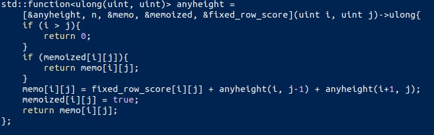

## Algolab-Infra

### Expert: Assertion Failure

Code expert has assertion failure? maybe it's because you allocated a 2D-Matrix of `10^5 * 10^5`elements. I'm not certain but that might be because indexes to all those requires now a number larger than 32 bits. See https://stackoverflow.com/a/216266/2550406 - or maybe the expert is just out of memory.

### Expert: Assertion Failure

Hand it in in the correct exercise :P

### Expert: Factor between score and wall time is too small.

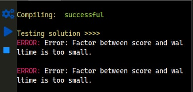

That seems to happen when the exectuable (even just optionally) accepts command line inputs. Like this one:

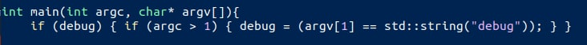

Or when it prints too many debug prints.

### Expert: Audit Files

> Please ignore the warning about the audit files, it does not affect your solution but only the logfiles. We will try to fix this soon. - Michael Hoffmann

## Algorithms

Things to know by heart or at least well. You will have encountered them multiple time by the time the exam comes.

### Binary Search

See [hand](#hand). Basic important things:

* `left` and `right` are inclusive.
  `while(left < right)`
* The end result is `left` and `right` but not necessarily `mid`!
* use `mid = left + (right - left)/2` to avoid overflows
* make sure there are no endless loops: If the mid assignment rounds down, it will choose left over and over again. So if the `left` case does not actually modify anything when `mid==left`, (i.e. it only does `left=mid`) then we need `mid = left + (right - left + 1)/2` instead.

* write the simple structure first:

  ```c++
  while (left < right) // once this is done, left will equal right
  {
      mid = left + (right - left)/2; // avoid overflows
  							// Note: this rounds down.
      value = compute(mid);
      // think about what it means when value is bigger, equals, smaller.
      if (value < SEARCHTERM){
      	// increase index, it is too small    
      	left = mid + 1;
      } else {
          right = mid; // mid could be it, or it could be smaller.
      }
  }
  // left == right now. But maybe the last computation was a "not good" result. Easiest way: just compute it again.
  value = compute(left);
  ```

* think about the rounding this way: We don't want to endless-loop.
  So if we had a remaining interval of size 2, and we chose the right one (in this example), nothing would change, that means we want to choose the other one if in doubt. This depends on in which case the `+ 1` lies.
  If you want to choose the right case in doubt, use `mid = left + (right - left + 1)/2` instead, for rounding up.

* Double-Check: is the value scaling with the index, or inversely? If the latter, maybe switch the cases?

### Sliding Windows

See [Defensive Line](#defensive-line).

While right is not at end, continually increase it. In each such iteration first move left as far right as you can to make the interval smaller. Then do a check, and then increase the interval to the right one.

```c++
// initialize sum to vec[0], left to 0, right to 1
while (r <= vec.end()) // right exclusive
    {
        while (moving_left_is_possible // l < r-1
               && moving_left_is_reasonable)// sum too big
        {
            currentSum -= vec[l];
            l++;
        }

        if (currentSum == k) // If interval interesting
        {
            ranges.push_back({l, r});
        }

        if (moving_right_is_possible) // r < vec.end()
            // it is now reasonable, because moving left
            // is not possible now.
        {
            currentSum += vec[r]; // Advance right
            r++;
        } else {
            // breaking is okay because we wrapped up left
            // already. Thanks to right exclusive.
            break;
        }
    }
```

Right Exclusive also means that we can always first read the value and *then* increment `r/l`. 

Alternatively, only do one step in each loop and only have `if` statements inside it, that directly `continue`

### BFS

Just keep a deque, add the first entry, and while it is not empty continue visiting the children that are not visited.

Make sure to mark them as visited, and to check if there are no children / null children / infinite vertex.

To check for connected components, a simple way is to do BFS once from each vertex, but only if not visited already.

### DFS

Like BFS, but with a stack instead. That means when you throw children on it, and then the child's children, those will be handled first.

Keep track of when you visit a node while going "downwards" so that you can pop it when it is encountered the second time, to go back up.

### Max Independent Set / Min Vertex Cover

See advanced flow slides for how to code it. In rough:

1. Get a Maximum matching in the bipartite graph
2. For building the Max Independent Set, choose from left side all that are unmatched, and all that are in the maximum matching but whose right-side pendant we did not take.
3. For building the Max Independent Set, choose from right side all that are not directly connected to any leftside ones we have chosen. Because we want as many as we can.

> 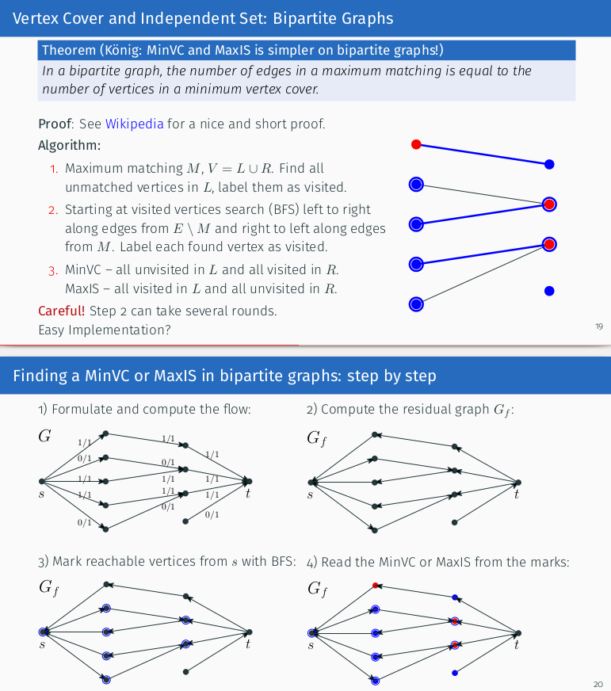

### Cover All Cases

Use a number in binary to represent every choice of taking or not taking an element - for fancy bruteforcing.

Then generate all cases with

```c++
for (int rep = 0; rep < (1<<num_elems); rep++){
	for (size_t pos=0; pos < num_elems; pos++)    {
        State state;
        if (rep & (1<<pos)){
            state.taken(pos);
        } else {
            state.nontaken(pos);
        }
        results.push_back(state);
    }
}
```

### Reduce Space

When there are too many entries that are useless because e.g. the intervals don't cover them, create new coordinates consisting of only the relevant entries. Usually that's every segment where there is either a start or an end of any interval.

So create a `std::map<oldcoord, newcoord>`, insert all relevant entries with value zero, then iterate over the keys and set the values to the `counter`. (Now never modify that map again.)

This has runtime $\mathcal{O}(n\log(n))$ but that is probably okay if you're going to sort the intervals anyway.

Make sure you don't overwrite your old coordinates if you still need them for score computation or something though.

## Github Repos

Where you can find inspiration in code, when you're stuck. I have not often looked up things, and I could have saved so much time doing that. Because often your approach is entirely correct and your mistake is something very simple.

* https://github.com/simon-hrabec/Algolab2020 (not all exercises, but with explanations)
* https://github.com/chaehni/AlgoLab (good topic summary, and some old exercise pdfs)
* https://github.com/JonasGessner/ETH-Algolab-2019
* https://github.com/YaweiYe29/AlgoLab-2017
* https://github.com/tehwalris/algolab

## Common Pitfalls

### Know The Algorithms

Too often I have implemented one of them myself. Get an overview what boost has to offer. The slides list some algorithms worth knowing:

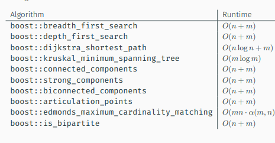

Also be aware of the tools at your disposal like the [Disjoint Sets for Clustering](#Disjoint-Sets--Cluster-Merging) I explained above, the `std::multiset` which stays sorted and allows for [fast access](How to use [lower bound on a set?](https://stackoverflow.com/a/10142015/2550406)) of the max and min. The boost flow algorithms. How to store properties with some boost Edge or Vertex or some CGAL Point. etc.

### Coding

* Careful about indices. Sometimes the exercise sheet has indices counting from `1`! That matters for the output.
* LP: Make sure you didn't copy paste a wrong lower bound.
* LP: Make sure you specified the lower bound (if you want one) not just with the value but also with `true`!
* LP: No need to use the `int` type from the example you pasted. Use double, long, or something more exact.
* CGAL `to_double` is not exact! If everything looks right but the outputs are slightly wrong, maybe that's it.
* CGAL: if the output is of type double, and it is inexplicably wrong in the hidden tests, maybe it is negative zero at some point? A cast to `long` fixes that.
* CGAL: Is the input type correct?
* CGAL disables asserts! Re-enable them with `#undef NDEBUG` before importing `cassert` for the first time.
* If `make` gives you incredibly ugly output, chances are it is trying to compile a binary file. do a `make clean` before making it again.
* CGAL: Use the `cgal_create_cmake_file && cmake . && make` if you use CGAL! Otherwise you get ugly template errors.
* Flow: Do you need edges in the reverse direction? (It's advisable to use the edge adder class from the examples)
* Flow: Are you iterating over the reverse edges as well as the original edges and that is why it's wrong?
* Cost Flow: If you negated the cost so you can use nonnegative algorithms, did you convert it back correctly in the end?
* Cost Flow: again, if you negated the cost... you need to consider MAX_COST more than just once, otherwise you disincentivize taking many short edges over one long edge.
* Binary Search / Sliding Window: It pays off to do it consistently. Learn it by heart in a correct way, then always do it the same way. 
* Sliding Window: Did you consider the end case? start case? what if left == right?
* Binary Search: Which way are you rounding? It should avoid endless loops in the case where you have only two elements left.

## Ideas For Exercises

If you're stuck, there are many good repos out there with full solutions. If you either don't get them or you want to not see code yet and only the idea, check them out here.

I didn't rephrase them much, these are just my notes. If they work for you, great. If they don't, sad. But I'm running out of motivation for this writeup. Sorry!

==**MAJOR SPOILER ALERT**==

### Even Pairs

First compute for every interval $[0,i]$ how whether it is even or odd. That can be done iteratively in one pass.

Simple Idea: Then compute for every interval $[i,j]$ whether it's even or odd by subtracting (even minus even is even, odd minus odd is even, otherwise odd).

Better Idea: Do combinatorics instead.
choosing: $\left(\matrix{num\_even\\2}\right)+\left(\matrix{num\_odd\\2}\right)$ even pairs. 
but that does always subtract the previous elements, especially always the first one. So we need to add the sums containing the first one manually as $+num\_even\_from\_zero$.

### Even Matrices

If the question is "how many" but not which, we can take a shortcut by using combinatorics, like in [even pairs](#Even-Pairs). Then we know how to compute the score for submatrices of height 1 in $\mathcal{O}(n)$.

Now we can compute for every fixed height submatrix the number of even matrices inside it that are of height as fixed. ( Reusing the sums of rows $i \text{ to } j$ for the rows $i \text{ to } j+1$ for some neat speedup. ) and then we can compute the generic solution of any height submatrices as 

$\mathtt{anyheight(from, to)} := \\     \qquad\mathtt{anyheight(from+1, to) + \\     \mathtt{anyheight(from, to-1) - \\     \mathtt{anyheight(from+1, to-1) + \\     \mathtt{fixedheight(from, to)}}}}$

The subtraction is because we counted some parts twice.

The base case is simply the fixed height for height 1 rows.

Use memoization for the remaining speedup.

### Search Snippets

Use a vector to track in one element for each wordtype how many occurrences we have during the interval. Then when something changes, update only that entry and the total num of words if it goes to / above zero.

Also, this is a nice function:

```c++
if (std::all_of(times_word_is_in_interval.begin(),
                            times_word_is_in_interval.end(),
                            [](uint elem){return elem>0;})){
```

### Ant

Kruskal: the MST that is taking the closest tree to the current network (globally).
               The second argument takes an output iterator. 

> The edges of the minimum spanning tree are output to this [Output Iterator](https://www.boost.org/sgi/stl/OutputIterator.html).  

​	            and this can be a vector!

```c++
  std::vector<edge_desc> mst;    // vector to store MST edges (not a property map!)
  boost::kruskal_minimum_spanning_tree(G, std::back_inserter(mst));
```

Prim: uses dijkstra, gives the MST that is shortest paths from the root provided.

If the MST is unique, they should be equivalent except that they have different runtimes and produce the MST in a different form.

Then use all the different MST built with different property maps as edges in one big graph and do one last dijkstra.

### Real Estates

* Careful if indices start at `1` in the input!
* Flow with cost: The "legal rules" are the flow. Inside them, we optimize the cost. Not the other way around.

### Maximize It

General LP:

* Make sure you didn't copy paste a wrong lower bound. Better to type it all by hand.
* Does the formula make sense?
* objective is minimized. If you want to maximize it and negate it, you need to change the sign of the result again.
* use `long`.
* `CGAL::to_double` can be used on `Quotients`  like the solution objective_value.

### Tiles

Think about simpler approach sooner than after 5 hours!

Simple approach:

```c++
/*
 * 1. connect elements that *could* be connected
 * 2. maximum cardinality matching
 * 3. # matches == num_nonobstructed_elements ?
 */
```

### Diet

LP: The equation number is the *second* argument to `lp.set_a` and the first is the variable!

Remember that `CGAL::to_double` is inexact. So write a function (for `floor`) that first reduces the double until it is smaller or equal than the exact number, and then increase it as long as it stays smaller.

```c++
double floor_to_double(CGAL::Quotient<ET> x){    
	double a = std::floor(CGAL::to_double(x));
    while (a > x) a -= 1;
    while (a+1 <= x) a+= 1;
    return a;
}
```

### H1N1

Idea is to build an MST with maximum width edges by negating all the edge weights. Then walk it for each query point. For building the MST, first build a graph where each face is a vertex except for all the infinite faces, which are all the same vertex, and then use that one as root.

Need to check initial position as well.

Copy from slides about how to store info inside the delaunay triangulation. it's worth the complexity.

And remember that it's ok to use `t.locate(point)` for getting the face and still use `t.nearest_vertex(point)` for making sure the initial position is not too close to any. That's easier than working with the face for this as well.

A Delaunay Triangulation face handle, vertex handle, edge handle can be dereferenced to get things. An `Edge` is explained [here](https://stackoverflow.com/questions/4837179/getting-a-vertex-handle-from-an-edge-iterator#comment115674370_4837696):

> Dereferencing an `Edge_iterator` will give you an `Edge` according to the [documentation](http://www.cgal.org/Manual/latest/doc_html/cgal_manual/TDS_2_ref/Concept_TriangulationDataStructure_2.html#Cross_link_anchor_1307).
>
> ```
> Edge` is definded as follows: `typedef std::pair<Face_handle,int> Edge;
> ```
>
> Dereferencing the `Face_handle` will give you a [Face](http://www.cgal.org/Manual/latest/doc_html/cgal_manual/TDS_2_ref/Concept_TriangulationDataStructure_2--Face.html#Cross_link_anchor_1309).

So we can use `edge_handle->first` to get the face handle. And then `mirror_edge` with the edge ~~handle~~ to get the opposite view of the edge. and `.first` again for that face handle.

* Prim gives us a distance map. That's like the edge weight map except that you can use the target vertex descriptor as key! So it's possible to walk the graph backwards and accessing the edges without building it.

#### Similar trick to get the vertices of an edge

https://stackoverflow.com/a/4837696/2550406

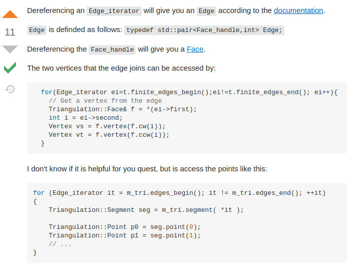

```c++
std::set<uint> reasonable_choices_for_s; reasonable_choices_for_s.insert(0);
for (auto e : boost::make_iterator_range(tri.finite_edges_begin(), tri.finite_edges_end())){
    Triangulation::Face& face = *(e.first);
    Vertex_handle v1 = face.vertex(face.cw(e.second));
    Vertex_handle v2 = face.vertex(face.ccw(e.second));
    reasonable_choices_for_s.insert(
        storage.squared_distance(v1->point(), v2->point(), v1->info().id, v2->info().id));
}
```

### Bistro

Use `vertexhandle->point()` to get a `K::Point_2` from a delaunay vertex handle. Note the arrow!

### San Francisco

`uint` up to $2^{32}$, `unsigned long` up to $2^{64}$.

I never finished this exercise.

### Radiation

* CGAL disables asserts. Reenable them with `#undef NDEBUG` before the import of `<cassert>`.
* Use correct input type! And generally, use double instead of int, for speedup that I don't understand but is backed by the docs.
* Use 

```c++
    // set solution strategy to avoid getting stuck
    CGAL::Quadratic_program_options options;
    options.set_pricing_strategy(CGAL::QP_BLAND);
    Solution s = CGAL::solve_linear_program(lp, ET(), options);
```

if it endlessly loops.

* **Always** set lower bounds *with* a boolean (or upper bounds): `lp.set_l(X, true, 2)`.

* Do the binary search right! (Or exponential search, if the smaller checks are fast and the big checks are slow. To safe time by not starting in the middle.)

* Think about these edge cases in the exponential search:

  * zero works already
  * smaller than maximum but larger than previous exponential check
  * larger than maximum -> fail
  * stepping from zero to one

  It's probably easiest to never stop early in the exponential search - just use it to find a good right bound for the binary search.

### Asterix The Gaul

The non-recursive iteration is done with `for(uint combi=0; combi<num_combinations; combi++)` and access the $i$-th bit with `if (combi & 1<<i)`

The split-and-list idea is to split the possible moves into two halfs. For each such set, compute all possible selections. Sort both sets by time and get rid of suboptimal items, then do a linear iteration over the sets to find whether any of the set1 elements has a matching set2 element. For that, start in one list form low numbers and the other from high numbers.

### Kingdom

Seems like I can model a flow problem with paths so that it enforces a maximum AND a minimum per path:

```
(City1)--[max]--> (Pathvertex1)--[min]-->(Sink)
                  | max - min |
(Source)--[min]-->(Pathvertex2)
                       \-----[max]----->(City2)
```

By adding a cost of 1 to the `| max - min |` path and a cost of 0 to all other, I incentivize taking the minimum first.

**But** I get time limits exceeded.

> In the integer capacity case, if *U* is the value of the max flow, then the complexity is *O(U \* (|E| + |V|\*log|V|))*, where *O(|E| + |V|\*log|V|)* is the complexity of the dijkstra algorithm and *U* is upper bound on number of iteration. In many real world cases number of iterations is much smaller than *U*.

See continuation a bit further down for how this really works.

### Kingdom

Think about a minimum flow per edge as an additional consuming edge to the sink and another edge that gives that back from the source. Since we use the max flow to enforce a MAXIMUM flow to the sink (i.e. all sink-paths from cities MUST be taken) we can add these additional sink paths for the edges as just as binding constraints. Only if the max flow saturates all edges to the sink is it okay.

The basic idea is this:

```c++
(City1)--[max]--> (Pathvertex1)--[min]-->(Sink)
                  | max - min |
(Source)--[min]-->(Pathvertex2)
                       \-----[max]----->(City2)
```

The takeaway is that no cost for preference is required because we need to fill them all anyway. Cost takes too long because it scales with the value of the max flow.

*More Generic Phrasing:* 
If we want to tell whether a flow is possible so that each edge has a minimum usage and each vertex has some original budget and some final requirement, we can model it as follows and then check whether the flow is maximal. We *need* to fill all connections to the sink - they stand for the edge minima. But now we've lost some of our flow, so we need to give it back at the edge destination with a connection from the source. (`max - min`).
Because we have sink connections also in the edges, the edges are forced to be taken, and so it is not a problem that maybe the additional sources fill the graph without taking enough edges.

### Important Bridges

Biconnected Components:

```c++
#include <boost/property_map.hpp>
        std::vector<unsigned long> compmap(mbridges);
        long nbc = boost::biconnected_components(OG, boost::make_iterator_property_map(compmap.begin(), boost::get(boost::edge_index, OG)));

```

A biconnected component is one where you can't remove a single vertex to disconnect it. We are looking for the edges that are alone inside a biconnected component.

Because if there were more edges in the component, then removing one would not matter - since it is strictly better than removing one whole vertex, and even that would be okay.

If there is only one edge, there are only two vertices in the component - and removing the edge would disconnect the two. Because if there was a different way, it would also be in the connected component.

### Hiking Maps

* If you get ugly output in `make`, do `make clean` and then retry.
* If something is broken, verify your constants! E.g. three times checking on the same line instead of three different lines is bad.
* Are start and end inclusive or exclusive? are their initial values consistent? and their abort conditions?
* Basic idea: sliding window but with a vector of "sum int" values carried along so that counting which variable is how often in the interval does not require $n$ runtime every time.
* Using a known point on one side of the line and `CGAL::oriented_side` to compare sides. It's either, boundary or one or the oder side.

### Casino Royale

* if assigning something to something else does not work, maybe switch them. As here: the Agents are not the flow - the available places in the train flow, and collect agents.

* Negating Flow Cost: `MAX - priority` does not work if it's about the sum of edges with different lengths. E.g. `(MAX-30) + (MAX-54) + (MAX-69)=234` and `MAX-128=1` so the latter has a smaller cost but would not be the better choice.
  The solution: `MAX*edgelength - priority` to add the superfluous maximum to the longer edge as well, for comparison.
* Instead of weird computations I struggle with, I can convert it also back by going over the used edges (e.g. store all edge descriptors that represent relevant missions) and checking whether they have flow (capacity minus residual_capacity > 0).
* When going over the graph, make sure to not consider the backwards going edges. E.g. by storing a boolean in the edge data when inserting them with the edge_adder.

### Chariot Race

* If you assign to a reference, you don't change the reference - you change the real object!
* Random Segfault? Might be stack overflow due to long recursion.
* Writing down algo first and working through it on paper is actually nice.
* Not using boost gave me a speedup of 4 whole seconds! It took 22 seconds with boost and 18 with my custom structure. So a speedup of 18%.
* Basic Idea: it's a tree and each subtree has three cases. So we do this building up from the leafs. The cases are "assuming root is taken", "assuming parent of root is taken and root is not", and "no assumptions about parent of root, and root is not".
  The reason we need three cases is that the parent being taken influences the subtree.

### Defensive Line

* Always remember: if you're using a boolean flag `initialized`, you need to set it to `true` once it is.

* Better solution than I have is [here](https://github.com/YaweiYe29/AlgoLab-2017/blob/master/week11/exercises/defensive_line.cpp#L25) and uses a DP table. Thinking for each attacker, if it had to choose in the range up to `j`, which one would it choose?
  For some `j` it would take the previous defender-block at `j-1`, for others it might take the `j` th but hence the previous attacker can only take the best option in the range `j-len`, and in others it might have no good choice.
  So every attacker builds upon the previous one, which was computed for all positions, and then we read the total sum out from the last entry.
  If there was a "no good choice" somewhere, in a path the final attacker actually relies on, then that has happened in the last agent because each one chose optimally. So if the last and the second last agent have the same score for the full range, we say `fail`.

* In other words: We want to know for an interval `[0, dj]` with a number of attackers `a` the maximum possible attacked defenders (according to the rules).
  We have to make sure all attackers are involved, but that can be checked in the end by looking if the best result with `a` attackers is the same as with `a - 1` attackers. ( ==Okay, no, that's actually wrong I think== but it passes all their tests. e.g. 3 1 1 1 1 3 with k=4 has score=4 for both a=1 and a=2.)
  The maximum with `a` attackers can be computed by considering what the best option would be: Either to take an interval ending at `dj` with the last attacker and hence only taking the optimum of the free interval before that with `a - 1` attackers or not taking an interval ending at the position `dj` and hence doing either nothing or taking the optimum for the interval up to `dj -1`.

* To fix that "it's actually wrong", we need to store how many attackers we used in each step.

* Elegant Sliding Window implementation at [gihtub](https://github.com/JonasGessner/ETH-Algolab-2019/blob/master/defensive_line.cpp#L82)

  ```c++
      while (r <= n)
      {
          while (currentSum > k) // Keep up with left
          {
              currentSum -= values.at(l);
              l++;
          }
  
          if (currentSum == k) // If left and right match
          {
              ranges.push_back({l, r});
          }
  
          if (r < n)
          {
              int atR = values.at(r); // Advance right
              currentSum += atR;
          }
          r++;
      }
  ```

  and another one [here](https://github.com/YaweiYe29/AlgoLab-2017/blob/master/week11/exercises/defensive_line.cpp#L25):

  ```c++
      while(head < n){
          int diff = defence_sum[head] - defence_sum[tail] + defence[tail];
          if(diff == k){
              blocks[head] = head - tail + 1;
              head++; tail++;
          } else if (diff < k){
              head++;
          } else {
              tail++;
          }
      }
  ```

* No need to store a vector of all intervals that end at a position... because there can be at most one such interval of the valid sum - we don't have negative numbers.

* sliding windows: ALWAYS update the sum, not just the left/right variable

#### Defensive Line vs Casino Royale

In Casino Royale we had missions that should not overlap (if we have space for only one agent in the train). In Defensive Line we have attacker intervals that should not overlap. So it might seem like we can code Defensive Line with Casino Royale's approach.

To model that, (it probably won't work, but here are thoughts on it), we have a flow of $1$ that shall flow through the line of defenders. At any point, it may either go to the next defender or take the direct edge to the end of the interval of sum $k$.
So while the flow is taking an interval, we are sure no second interval can be overlapping - except for at the defender where the interval ends, maybe?

To ensure that the end of an interval is not already taken again as the start of the next interval, we model each defender as two vertices: One $D_{in}$ and one $D_{out}$. The interval edges start at $D_{in}$ and end at some future $D_{out}$.

We also have the constraint that every attacker must attack some interval. That means in our model that we need to have $a$ interval-edges taken. This is a difference to Casino Royale where we want to fully maximize the profit of missions (think of attacked intervals as missions, with profit equal to number of defenders in it) (profitable missions are incentivized by *cost*).
In other words: The main difference between Defensive Line and Casino Royale is that in Casino Royale *If two intervals don't overlap, we can take both* and in Defensive Line *If two intervals don't overlap, we can only take both if we still have a spare attacker*.

We can run a flow and then check whether the number of taken interval-edges is equal to the number $a$ of attackers we have available. If it is equal, we're done. Otherwise, I don't really know how to deal with it?

We could perhaps use a multi-layered graph approach. Every time an interval-edge is taken, it leads the flow to the next layer. After $a$ transitions, there are no more interval-edges available so the flow has to walk the remaining defender line to the sink without choosing any new intervals.

So that could actually work, unless somebody spots a flaw?. However, the runtime complexity is not great with num_vertices = num_attackers * num_defendants. Successive Shortest Paths has Runtime Complexity $O(|E| + |V|*log|V|) $so we would end up with $O(possible\_intervals + num\_attackers*num\_defendants*log(num\_attackers*num\_defendants).$

> Why can't we simply take the $a$ of attackers who cover the most defenders in it (the $a$ top profitable missions in the flow)?


I think you might be right.

Running a mincost maxflow algo on the graph gives us some chosen intervals so that their sum of defendants is as large as can be. If there are exactly $a$ then we're happy. If there are more, we can choose the most profitable intervals that have flow, as you are suggesting.

But could there also be less than $a$ chosen intervals although it would be possible to choose more, at a higher cost?
We need to have every attacker attack a nonzero interval. If the best choice in terms of number of defendants covered would be to take one long interval, the flow will take that one. But sometimes it should not. I'll try attach an example picture.

Say we have attackers of strength 6, and defenders of strengths 5, 1, 1, 1, 1, 1, 1, 5. Then the best choice without the constraint that an attacker can only take one interval (Casino Royale Style) would be to take the interval with all the values 1, giving a total of six covered defenders.
But if we have two attackers that both *must* attack, then the best choice would be to take the first two defenders and the last two defenders, resulting in a total of four. Which is less, so the flow won't come up with it.

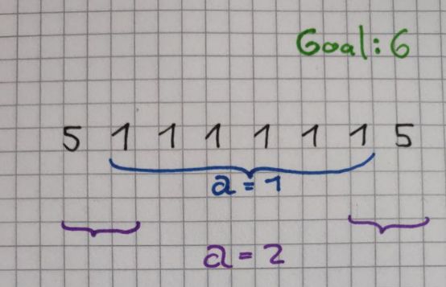

### World Cup

Basic idea: do LP with the constraints first, maximizing profit. One limit for supply in each warehouse, one constraint for sum of incoming beer per stadium, and one constraint per stadium that the sum of incoming alcohol times its percentage must be less or equal to the allowed liters. In those constraints, the contour lines cause some reduced revenue per connection.
Speedup: use delaunay to filter out the contour lines that have no point in range.

**rounding down to double**: changed parameter type of the example the algolab people give in `hello_exact.cpp`:

```c++
double floor_to_double(const CGAL::Quotient<ET> x)
{
double a = std::floor(CGAL::to_double(x));
while (a > x) a -= 1;
while (a+1 <= x) a += 1;
return a;
}
```

**Locally Passing, but Wrong Answer online**:

```c++
std::cout << (long)(floor_to_double(-s.objective_value()));
```

The cast to `(long)` somehow helps. Maybe it got rid of negative zero for me.

**Test if circle is empty** by using delaunay triangulation of all points that could be inside and test which of them is the nearest and whether it is inside. We are told that there aren't many circles with anything inside, so this should be fast.

**Always check your input type**

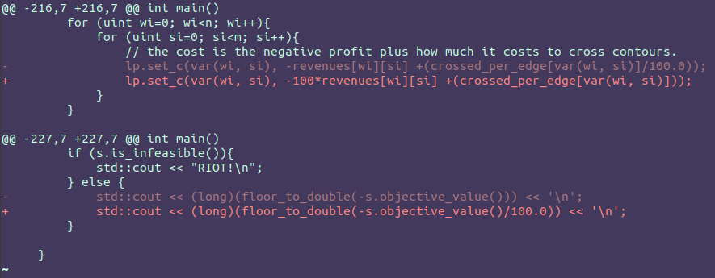

my LP input type was defined as `int`, not `double`, so the bright version worked and the dim version did not work.

### New York

* Do DP with table building it up instead of trying to be smart and somehow subtracting from the prefix sum. That does not work for finding minima/maxima when sliding.
* When you first had a DP table and then reduce that to two vectors, be very careful to read from the right one and write to the right one: In the first run after the initialization, it's probably different than after that - but only for reading.
* When you think it's sliding window or greedy, maybe it's DP!
* But maybe it's actually not fast enough with DP!
* I ended up with 60% sliding window and 100% doing it recursively. For the recursive bfs, make sure to use a reference instead of copying the parameters every time, and restore the old state of them before returning.
* I guess the problem with the sliding window is that I moved from the leaves upwards and hence re-inserted some temperatures multiple times when there were intersections. The DFS approach comes from the other side and does not recompute those.

### Lestrade

* Careful when shuffling things. Are there really no relations to other vectors?

* Storing information inside Delaunay *Vertices* requires the import differently than in the tutorial slides pdf:
  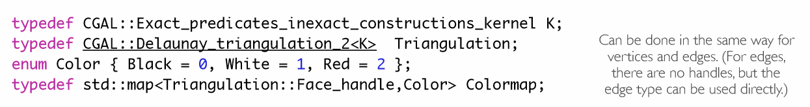

  ```c++
  #include <CGAL/Exact_predicates_inexact_constructions_kernel.h>
  #include <CGAL/Delaunay_triangulation_2.h>
  #include <CGAL/Triangulation_face_base_with_info_2.h>
  #include <CGAL/Triangulation_vertex_base_with_info_2.h>
  typedef CGAL::Exact_predicates_inexact_constructions_kernel K;
  typedef CGAL::Triangulation_vertex_base_with_info_2<GangMember,K> Vb;
  typedef CGAL::Triangulation_face_base_2<K> Fb;
  typedef CGAL::Triangulation_data_structure_2<Vb,Fb> Tds;
  typedef CGAL::Delaunay_triangulation_2<K,Tds> Triangulation;
  typedef Triangulation::Face_handle Face_handle;
  typedef Triangulation::Vertex_handle Vertex_handle;
  typedef Triangulation::Point  Point;
  ```

* There is an insert function that accepts a vector of pairs! [It](https://doc.cgal.org/latest/Triangulation_2/classCGAL_1_1Delaunay__triangulation__2.html#a0ea76bda5cb948080eebf974af7fc506) gave me the last 30% of the points!!

* `tri.locate(Point p)` returns a face handle. `nearest_vertex` a vertex handle.

* Comparisons with ints and exact types in LP: `s.objective_value() > ET((long unsigned int)z)`

* Delaunay: build in O(b * log b) , query in O(log b) wenn b d azahl pünkt i de triangulation isch. D.h. q mal querie isch O(q log b). Und das heisst es isch actually besser wenn mer chliners b als q hät wenn mer cha wähle 
  bi noni 100% sicher aber... also sägemer du hesch zwei zahle `a << b`. Denn isch wenn s set `A` zum builde bruchsch und nacher für jede im set `B` queriesch d total runtime `O(a log(a) + b log(a))`. Umgekehrt wärs `O(b log(b) + a log(b))`. D frag isch also ob `log(a)` oder `log(b)` grösser isch. mit me chlinere set pünkt und me grössere set queries isch also besser. Stimmt die logik?

* Skip those agents that are nearest to the same gang member but cost more.

* ```c++
  /*
   *  Delaunay on the network of gang members to find for each agent the corresponding gang member.
   *  Then LP with the constraints of size agents hours plus an equation requiring to be below
   *  the cost of holmes.
   *  If not feasible, say Holmes, else Lestrade.
   *
   *  There are quite many gang members. Luckily they aren't relevant for the LP part.
   *  4k agents was already possible once for LP, so why not again.
   */
  ```

### Clues

* use `sync_with_stdio(false)` to get the last test without TLE.

If there is a 2-coloring in the graph, there is also one in the delaunay triangulation (in both, we only consider the connections between points that are close enough).

That does not mean that a valid 2-coloring in the delaunay graph implies a valid 2-coloring in the real graph, but it allows us to abort early. 

If we did not abort early, only the points in the same connected component are relevant - all other points are far away anyway. And **the connected components of the delaunay graph and of the real graph are the same**. Because the delaunay graph contains the nearest neighbours.

To check for the connection inside the same color set, we build another delaunay triangulation. That's the secret trick! Then we can easily look at the closest neighbour distance for each in the set in less than $\mathcal{O}(n^2)$. The rhombus fact below is not useful for this in any way.

#### Rhombus Fact

| short diag                                                   | long diag                                                    |
| ------------------------------------------------------------ | ------------------------------------------------------------ |
| 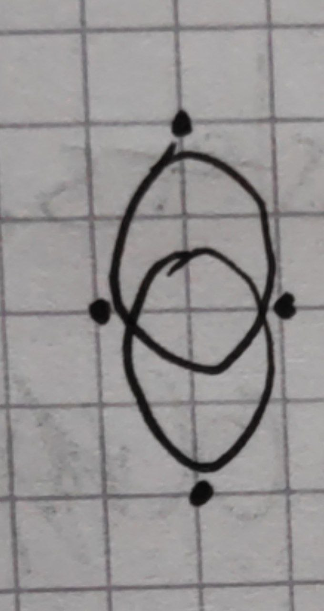 | 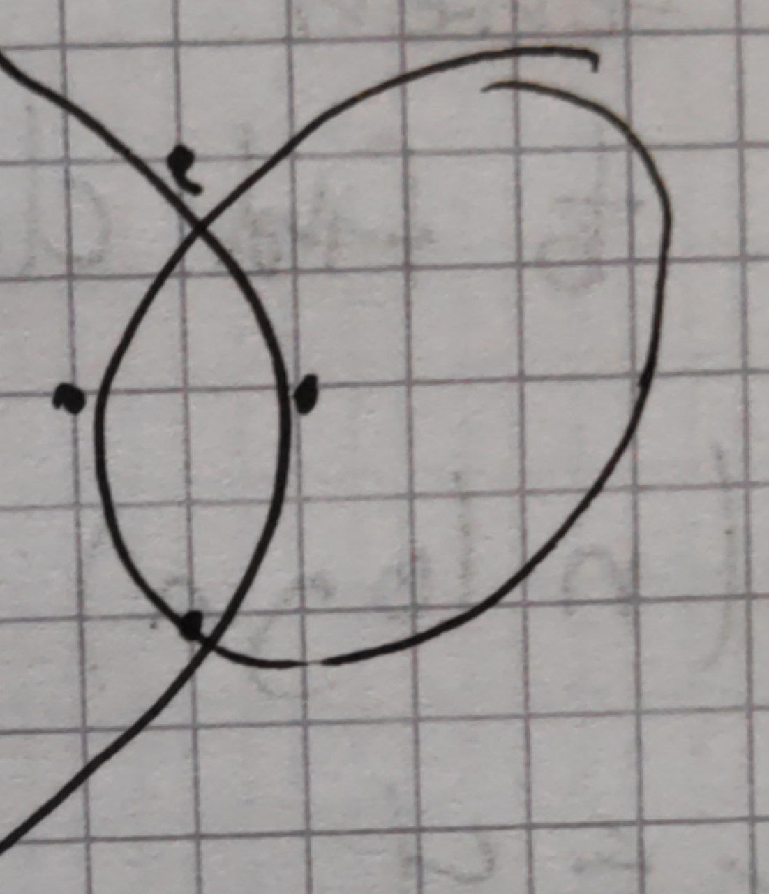 |

Circumcircle must be empty, so the edge case where a point is completely hidden can happen but the diagonal will always be the shorter one - so it can't be hidden over connections that are all longer than we allow if the hidden point is close.

#### Early Aborts

* Make sure you're reading all of the inputs
* If you check for visited / not visited in BFS, think about the case where a vertex is already visited (and hence would be skipped) before killing the whole project.

### Hand

Basic Idea: Delaunay Triangulation of tents and then do BFS on it with a given distance. That finds the number of families. Then do that multiple times with binary search to answer the reverse question. Finally, note that $k\leq4$ so merging remaining clusters that are too small is not hard.

Alternatively, [Simon Hrabec](https://github.com/simon-hrabec/Algolab2020/tree/main/Week%2011%20-%20Hand) found a solution that does not require binary search. This is probably what I missed for the last 20%. He sorts the delaunay edges by distance and iterates through the distances, merging clusters of tents that *must* be together until done.

* Refresh how to do bfs on a delaunay graph. Best look at the code in ex11/hand again.

* Remember to skip infinite vertices.

* increment circulators even when using `continue`, not just in the normal case!

* Remember to check if the circulator is empty (equal to `NULL`)

* If the triangulation does weird stuff - like giving you a NULL circulator - better make sure you read the points in correctly!

* Simple Binary Search. Learn by heart! Except that this paste here is wrong. Use the `ex11/hand`  one.

  ```c++
  ulong left = 0; ulong right = (1UL<<50)+1; //both inclusive
  ulong mid = 0;
  while (left < right){
      mid = left + (right - left)/2;
      ulong f = f_for_s0(mid, tri, k, n);
      if (f < f0){
          // that's too small
          left = mid+1;
      } else {
          // f >= f0
          // that's big enough, maybe too big
          right = mid;
      }
  }
  // now left == right. But maybe the last check was actually on the "wrong" side. So don't use mid here.
  ulong biggest_s = right;
  ```

  * one mistake I made is because the `f` is smaller for larger inputs `s`. So I had to *decrease* the searched-for input to make`f` larger.
  * another one is the rounding in the computation of `mid`.
    Usually, we would use `mid = left + (right-left)/2` to avoid overflows.
    Now, however, I want a round up in the case `[enough_f, not_enough_f]` because in the round down case it would leave `left` equal and in the round up case it reduces `right` by `1`. That difference became a problem because I had to switch when left and when right were assigned, due to the previous point.

* 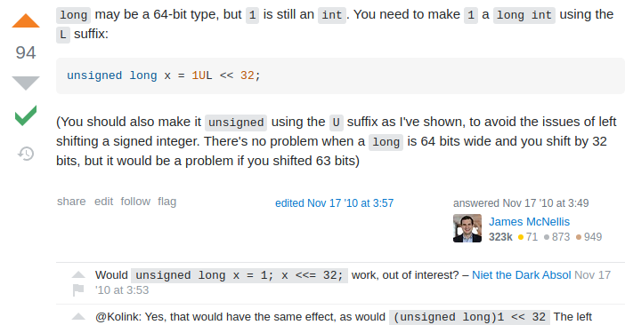

### Moving Books

* use the std::multiset. remove only one of the multiple elements with:

  ```c++
  std::multiset<int>::iterator hit(mySet.find(5));
  if (hit!= mySet.end()) mySet.erase(hit);
  ```

* The trick from the solutions is to think about  what happens in one round, and loop over that. Using sorted boxes and sorted people, we can skip the weak ones. In total, that sums up to only num_boxes.

* I had sorted both lists - all I was missing was the multiset instead of manually doing binary search

  ```c++
   auto boxsort = [](uint a, uint b){return a > b;};
          std::multiset<uint, decltype(boxsort)> boxes {boxsort};
  //...
  // carry box as heavy as I can
  // "lower_bound" gets me the first element that is the key or later (smaller)
  auto boxit = boxes.lower_bound(f.str);
  ```

* alternative idea: test if it is possible to do in `r` rounds and then do binary search. Reasonable if the test is fast.

* Estimate based on numbers how runtimey I need to be!

* With multiset, can specify the comparator just like with priority_queue (except there is no middle template type). The set is ordered, so `.begin()` and `.rbegin()` access the smallest/largest entry.

* Multiset has its own `lower_bound()` function. It returns the first key that is equal or later in the multiset. This is based on the provided comparator.

* Multiset comparator should take either copies or `const` references.

### Hong Kong

* You can use `tri.segment(facehandle, i).squared_length()`. instead of 

  ```c++
  num_t edgelen = CGAL::squared_distance(
      fh->vertex(fh->cw(i))->point(),
      fh->vertex(fh->ccw(i))->point());
  ```

* Using a priority queue with faces sorted descending by their newest value means we don't propagate some of the values that would just be overwritten again soon: Starting with the largest escapable value and propagating it, then continuing sorted by that, means that the largest value must be  the first one a face gets assigned. So all others can be dropped! Compute this way the largest escapable value per face, then query the balloons unconstrained.

* Is this easier than the maxwidth MST approach in [H1N1](#h1n1)? No, but it's more appropriate because we have multiple goals to reach.

* Accept the first update always! Otherwise you might not propagate your initial state correctly.

* Given a face, there is no way to get the edge handle directly. But why would you want that? The info for the vertices, you have.

* Think about why they provided a footnote. It's maybe not just to mislead you.

* You can use `facehandle->neighbor(i)` as per [docs](https://algolab.inf.ethz.ch/doc/cgal/doc_html/TDS_2/classTriangulationDataStructure__2_1_1Face.html#a049f6aad0b7303c8a9a6051857148355)

* Save maximum freeable in each face, bottom-up. No idea about the runtime, it takes a while to propagate. Just do it.

* Same size needed for going through an edge when comparing squared, as for total takeoff inside a face: Both require $(2(s+r))^2$. so can store both as one tracker.

* ```c++
  /* Redo for exam prep.
   *
   * Triangles with balloons inside. Output yes or no whether the balloon can launch.
   * Give each balloon an id.
   *
   * Check if balloon can exist at its starting position. if no, the answer is no.
   *      Existence: distance to the closest tree is larger or equal to balloonradius+treeradius
   *
   * Then check if balloon can launch at that position, because that's the first test case.
   *      Launch at Position: Distance to the closest tree is larger or equal to 2(balloonradius+tree)
   *
   * Create a sorted queue containing Faces to consider and the largest value currently in the queue
   * they should receive. We avoid useless propagations by always taking the largest.
   * This way, propagate to each face the maximum balloon radius that can still escape somehow.
   *
   * Now for each balloon that can exist, locate the face it is in and check if it can escape.
   *
   * To compute for a face how large balloons it lets launch, the answer while the circumcenter is
   * inside the triangle is the distance circumcenter<->corner.
   * If the circumcenter is outside, the width available grows larger as you move from the opposite
   * corner through the triangle and outside towards the circumcenter. Any balloon that entered the 
   * triangle from outside is large enough to pass through that edge because it is the largest edge.
   * And balloons who spawned inside the triangle and can exist have enough distance to reach the
   * circumcenter.
  */
  ```

  

* Recall that if you have $(r+s)^2$ already computed, and you want to compute $(2(r+s))^2$, you can do $\mathbf{4} \cdot (r+s)^2$

* There is apparently some speedup from using `emplace` instead of `push` which is required for this exercise?! Either that or the usage of `VertexInfo` in the triangulation... but I've tested it now and the difference is the emplace.

* TLE: because I added all faces multiple times at the start. That's not too big a difference in terms of runtime, but made the queue too long. So instead only insert the finite faces once and for the infinite faces the neighbours (or themselves once. whatever the approach needs.)

* Alternative against TLE: keep a count of the number of optimal triangles. Modify it when a triangle is added ot the queue and when it is removed from the queue. When all are optimal, stop.

### Motorcycles

* It seems like using an inexact kernel first, and an exact kernel only if there is an intersection, is not a great speedup.
* Avoid dividing by zero :P
* If the question is only "yes" or "no", perhaps we can make general decisions. Like "any biker slower than the fastest either reaches it too late and dies, does not reach it because it died earlier, or is moving in the other direction. Since the last one can be assumed not to be the case (test case restriction) and the other two have the same end result, we just store that it failed".
* The basic idea was to sort the bikers by speed in x direction. The fastest biker will always do it. The second fastest only if it is not blocked by one of the faster bikers. Etc. Assuming they all move upwards, we only need to store the limiting biker. A new biker starting above the topmost speedy biker will survive, a new biker starting below it will not survive. And then extend to the general case: what if some of them move downwards?
  In that case, they wouldn't be blocked by the upwards-moving limiting biker above them, but below them. Or by a downwards-moving limiting biker below them. (not a downwards moving biker above them, because that one has flatter slope than the currently considered biker).

### Punch

* LP: no way to do integer linear programming during exam. The libraries for it are probably not available. See [here](https://doc.cgal.org/latest/Solver_interface/Solver_interface_2mixed_integer_program_8cpp-example.html).
  Using input type `CGAL::Gmpz` does not seem to make the variables integral, it's only about the types used for input (and the "exact type" is just always `Gmpz` except when the input type is `Gmpq`).
* DP: If the table starts at 0, maybe need `k+1` instead of `k` width?!
* Basic DP Idea: Store total cost given volume taken of i-th beverage and all before. So the table is num-beverages rows and num-volume-taken columns. In the end read out the cheapest cost (or if there are multiple the best variety one.) So in each entry store the cost and the variety.
  Table entries are computed based on what would be better - either taking the best of this volume without the latest drink, or taking this drink at least once and adding the best of this drinks' row for the smaller volume.
* In other words (after solving again):
  Each kind of drink is either taken or not, for a given volume. If it is taken, look at the same drink for less volume to be achieved (plus the cost of that bottle), if it is not taken, look at the same volume with one less drink to choose from. Always choose the best of these options.

### Evolution

* When sorting with a priority queue, remember that the sorting lambda is inversed. Because the queue always gives you the *largest* element and the lambda returns `true` if it is *smaller*.
* If results are wrong and you have loops, check if some loops should be if, or if some if statements should be loops. Easiest check with a simple test case to work through and enough debug prints.
* Using DFS, we can incrementally compute all `(start, end)` paths instead of having to do $n^2$ comparisons!
* Binary search on the tree paths for speedup.
* The solution DFS approach works this way: Use DFS to store the path for each node up to the root explicitly at the node. Then we can do binary search on the stored path to find the oldert still okay species.
* In order to use less memory, they handle all queries that start at that node while doing the bfs, hence not having to store the path for longer.

### inball

* Remember that the objective value is *minimized*.
* Think about it in more geometric than algebraic terms?
* If, for some reason, you split up x and y into $x^2$, $xy$, $y^2$, you will have to check whether the x are the same. can't enforce that.
* Square / lift the given values, not the variables.
* It might help to think about what exactly actually is unknown. In this case the center and radius.
* Write everything anew when you change the idea! too much to forget changing!

### Marathon

* Read in everything, including the number of test cases
* loop up to the correct variable! (n vs m)
* Basic Idea: We want to find number of runners such that each still takes the fastest route. So we model the speed as cost and increase the runner number until that no longer is possible and a more costly cost is taken. That is checkable even with binary search, because we know how much the cost *should* be given n runners.

### Sith

* Increment your circulators!!
* use the disjoint_sets.
* Tracking set sizes must be done by you, not the set library!
* Apparently sometimes points actually have no neighbours in the triangulation. Check if `circ != 0`.
* Check your input types!!
* Apparently you can choose which planet you start on, on every day.
* Basic Idea: sort the planets by their time-to-live. Then insert the longest-living into triangulation, then the second-longest etc. Each time look at the neighbours of the newly inserted and check their distance. If they are connected, merge their clusters. If further away ones are in range, they are also in range of the neighbour between us and them, so they are already connected now - no need to check them manually.
  Every cluster always contains only planets it would want to take. So never add a planet that dies sooner than the best clustersize. Instead, stop then. Nothing is getting better from now. The best cluster will never get better, and others only as good.
* `uint * uint` can not become a long
* Check if the cluster is the same we're already in!
* re-find your union representatives more often

### Fleetrace

* Maximum Matching: do a mincost maxflow and allow every entry to directly flow to the sink with maximum cost. Then it's just a cost minimzation. (Which we want, because otherwise the maxflow could be two boatpairs instead of one better boatpair)
* Since all boats participate, the negation of score to cost and back is easier.
  total score = num_boats * MAXCOST - total_cost.
* Don't add edges per pair to each boat! These are supposed to be unique.
* Read inputs in the right order!

### Secret Service

* initialize the vectors backing an iterator property map to its size.
* Dijkstra apparently sets unconnected components to INT_MAX?
* think more about weird edge cases that might invalidate the whole approach. But also, think less about edge cases. ....
* Basic Idea of Solution:
  * compute a bipartite graph and minimize the longest edge.
    Computing the graph requires multiple shelter vertices where the second costs $entering\text{-}time$ more than the first. For each shelter, compute and remember dijkstra so we can set up the big bipartite graph with edges of length shortest path.
  * Then on the bipartite graph we want to minimize the longest edge. We do a maximum cardinality matching for that. and check if the matching indeed contains all agents. Then do binary search on the time.
* Don't use the `out` files as input!

### Germs

* For each bacterium, only the closest one (and the borders) matter. So use delaunay to get the closest other and compute the time to live.

* Always make sure to increment circulators, check them for null, and check them for infiniteness.

* Binary search with an unknown upper end? Well, exponential search is one option... but just choosing some lower initial guess without modifying the boundaries is another :D
  Of course important to make sure that `firstrun` is correctly set/reset.

  ```c++
  mid = firstrun ? initialguess : (left + (right - left)/2);
  firstrun = false;
  ```

### Idefix

* when using a circulator, always keep in mind that it will be null/0 if there is no neighbour yet inserted. Even if it is a triangulation, because it has dimension 0 then.
* use `max_element`, not `max`, on a vector.
* When doing BFS, think about which children should be visited. Especially don't forget that you need to filter the edge length.
* If something is wrong, maybe you're accessing the wrong iterator? debug prints and small tests help.
* binary search over the limited space of relevant distances, not over all possible distances, for the last few percent score. For that, simply take a sorted list of relevant radii and do binsearch over the vector indices.

### Algocoon

* A mincut/maxflow assigns all other vertices to the optimal set, given a source vertex in set 1 and a sink vertex in set 0.
  Hence, to find the best cut if we don't know the source and sink, we have a better option than trying all $n^2$ pairs: Fix the first vertex as in set zero and try every other sink. Maybe our assumption was right and the first vertex actually is in set zero - then we're good. Or we were wrong, so we do the same thing again fixing it to set one instead.
  The reason this works is because given any source in the starting set is supposed to give you a minimum cut that is as good as it gets - it either assigns all other vertices "correctly" (so it's the same cut) or does so in a different way. But the different way only happens if the others are not reachable from the source, which results in a smaller mincut. So a better one.
* There's no need to worry about enclaves of one set inside the other - we can just engulf it. Except when the enclave contains the sink, but if there is only one enclave, there's no added difficulty.

### First hit

For the last 10%, one needs to compare segments instead of rays. Apparently, that is faster - because you have less intersections. Some repos also shuffle the input. I'm still to slow with both, despite using different Kernels for differnet checks.

### Switzerland

> The first piece of information that leads to this solution is that we don't need to know what provinces are part of that free-standing subset, only if it exist or not. When exploring possible way how to represent the problem on of the seemingly possible options is flow. We create source and sink. If province has positive balance it has incoming edge from the source (of such value). If negative it has an outgoing edge to sink. All debts will be modeled as edges between the provinces. In this definition a free-standing subset is a group of provinces that will receive more flow (money) from the source than will need to give. In terms of flow we can say it will create a bottle neck in the network. This is the main idea. If there is such subset than some of the money will stay and we detect that the flow is smaller that the sum of the incoming edges. Therefore we just call the maximum flow algorithm and compare the result with the expected value.
> [- Simon Hrabec](https://github.com/simon-hrabec/Algolab2020/tree/main/Week%2010%20-%20Asterix%20in%20Switzerland)

I think there are a few things unclear in the task. They remained unanswered on moodle. But I'm no longer certain whether the (b) even matters. Because a bit later at least "free-standing" is well defined. $\Rightarrow$ If a task is unclear, try ignoring the unclear part and see if it is solveable despite that.

> a) In the test cases 2 and 3 it is claimed that for all i and j we have the debt from i to j larger than the sum of absolute values of balances. That seems to be not true though, because for some i,j the debt is actually zero (and hence not provided as input).
>
> b) The sentence "One or several provinces want to form a new union, so that the debts among them can be
> canceled." is ambiguous. I understand it to mean that whichever provinces form a union discard all the union-internal debts ("so that ..." is a goal). My friend understands it to mean that only provinces that have debts to each other in a way that they would cancel out are allowed to form a union ("so that ..." is a constraint).
> Which one is true? It's hard to tell based on the tests, since they have rather big numbers

The question in the exercise is whether there is a group such that the money edges into it sum up to strictly more than the money edges out of it.
If modelled as flow, this means that there is some money not drained out. And for every non-freestanding unit there are more draining edge capacities than incoming ones, so it's an "if and only if" relationship.
Model: Flow from source for positive initial balances, and to sink for negative initial balances. If a negative balance is filled, cool - if it's overfilled, the outflow is limited compared to the inflow.

### Antenna

Build a `min_circle` from CGAL with exact constructions but not sqrt. Then build a new mincircle with exact and sqrt from the support set which is always small. now we can compute the square root of the radius easily.

### Tracking

* at least $k$ rivers have to be taken (edges). So I build a graph with $k+1$ layers. Only the rivers allow advancing to the next layer, but they also exist as normal edges in the last layer, because maybe we use them in addition. (e.g. very long line of only rivers).
* tricky when the graph is bidirectional: $a\rightarrow b$ and $b\rightarrow a$ both need to go to the next layer.

### Buddy Selection

We need to find out whether there is a solution that is better than given for each pair. So we remove all options that are worse than given or equal, and then we just need any matching. So we run the Maximum Cardinality Matching.

The alternative idea of using a Maximum Weighted Matching does not work. It would maximize the sum, not the minimum.

### Boats

Pretty straightforward greedy EDF.

1. Sort boats by position of their ring.
2. for each ring, in order, grab a boat and shift it as far left as possible. Because we want to guarantee as much space for the future as possible (if we were to actually take this boat). Now consider all the boats that we still overlap with because their ring is in our space. Of all those conflicting, choose the one that ends first, to give the future space.
3. skip boats we did not choose and are now disabled.

Proof: If our solution were not optimal, the optimal solution chooses a boat that is further to the right ending. If that ship is okay, then ours is also okay though.

### Octopussy

Always defuse the soonest exploding bomb. If that requires defusing others first, defuse those others on the way. 

Reasoning: If we don't defuse the soonest bomb first, it will explode sooner or later. There may be an alternative way, but it would at best be just as good I think. The best time to defuse all bombs is the best time to defuse all-1 bombs plus the time of the last bomb, no matter the ordering.

Simplementation: Starting from the root, store for each node the earliest value it or its parent explodes. Then always take the soonest first? I.e. sort and check?

### Surveillance

I first understood this wrong and only made one graph which connects from the photos to the police stations. But what if police can't reach the photo? That's why we need two layers in the graph. And the photos allow moving from one layer ot the other.

### Knights

* literal "corner cases" are different from the rest

* It's a grid? Let's do Flow, not DP

* Vertex with an entry and an exit for a vertex capacity.

* Make use of tests constraints for thinking. in this case:

  ```c++
  /* In the case c==1 it is obvious that we need some magic
      to prevent knights from using the intersection after it has been used.
  
      In the case c==2 I made the assumption that an intersection can never 
      be entered and left by more than 2 knights anyway, 
  so I don't need further checks.
      An intersection with a there-spawned knight on it can be used by a second
      knight without problem. A third could also sneak in,
  because the spawning of the original knight did not fill any pipe yet, 
  but then we only have one way out left. 
      So at most two can leave any intersection.
      This makes the case of capacity c >= 2 easier.
  
      For c == 1, we build a complex vertex construct consisting of 
      an entry-vertex, and an exit-vertex. A one-way connection with
      capacity c goes from entry to exit.
      From all surrounding complexVertexes exit-vertexes a line goes to
      the entry-vertex. But none back. The connection back comes from
      the exit-vertex.
      Of course, each one-directional connection still needs a second
      0-capacity line back for the flow algo.
  
          For ease of implementation I will not handle c==1 seperately,
  despite the fact that it could be faster. */
  ```

### Legions

* Try use a simpler geometric approach.
* Working with the normal vector can work, but in this case it's easier to say the distance (speed times time) should be small enough. Then flip the sign if the start point is on the other side of the line.

### Return of the Jedi

* Precompute the largest distance edge below each MST node

* Then instead of finding cycles and walking them, find the common ancestor of the leafs with binary search.

* Take precomputed longest edge in const time.

* Simpler approach: build MST and then do as [cheahni](https://github.com/chaehni/AlgoLab/blob/master/2019/week10/return_of_the_jedi/src/algorithm.cpp) does and loop over the edges in the original graph - try adding each one and check out the difference if we took that one and removed the largest in the path instead. For `largest()`, he simply does a DFS and stores it. For some reason, my BFS approach is slower... and wrong. Maybe because there's less tracking of memory involved?

  > sägemer en MST a->b->c->d->e->f. Denn wenn ich zersch c->f querie und denn a->f denn isch no problem, es reused was ich computed han. Aber wenn ich b->e querie und nacher a->f denn berechnets es vo neuem.

  ==> do DFS in such cases. it's easier.

* If you use a filtered graph, make sure to copy it for speedup, but do not declare the target graph's vertex number in advance - else all existing vertices are still there.

* `boost::edge()` seems to be slow. [avoid](https://stackoverflow.com/q/66043842/2550406).

### Placing Knights

* Maximum Independent set
* Bipartite graph ==> can look at slides for advanced flows
* Make Sure you're actually adding reverse edges for the flow. Especially when it segfaults!
  I was adding the edges with `boost::add_edge` despite having created their edge adder.

### Real Estate Market

* Given some rules and something to maximize. We enforce the rules as flow (so that even a maxflow is still legal) and then choose among the maxflows the best profit using *cost*. 

* If e.g. every buyer can only buy one house, we give them only one incoming capacity.
* If e.g. every state allows only $n$ sales, we give it $n$ drain capacity.

### Iron islands

Split task in two: either $pyke$ is involved somewhere in the middle, or it is not involved or only at the start. If it is not involved, just do sliding window from pyke in every direction. Doing the sliding window, keep track of plans that don't involve all people and to involve pyke - then later test those combinations.

Putting things into sets is hard. So use pointers instead, keeping the actual things safely in a vector.

### Fighting Pits Of Meereen

$2^n$ DP storage bitshift trickery? I haven't fully done that yet

Quote from moodle:

> Suppose you want to encode x and y into one integer and you know that $0<=x<=4$ then you can use $z=y*5 + x$ as an encoding of $x$ and $y$ and get back $x$ and $y$ by $x=z%5$ and $y=(z-x)/5$.

[Zilin Wang](https://github.com/ZilinIB/ETH-Algolab/blob/master/week11/fighting%20pits%20of%20meereen/src/main.cpp) has linked his code and it looks simpler than the others I have seen. He has a DP table where `i` represents the $i$-th fighter, $j$ represents the difference between left and right queue and from that he computes the next value for both queues. If the resulting score is better than what is already stored, he saves it. And the variety of each queue is carried along while computing, once for the left and once for the right queue. All the types encoded into a small number.

### Car Sharing

* Multi-Layered graph for timesteps. Allow parking infinitely for no profit and all missions as per their time from start to end.
* Be faster with a smaller graph, so no need for vertices that *only* park and have no mission start or end.

### India

Idea: We want the coffers as flow and find the largest flow fulfilling the budget. So we just do mincost-maxflow for a given num coffers and vary the number until our budget is enough.

### Lannister / Casterly Rock

* Right angle to a vector is swapping the coordinates and negating one of them (in 2D). Not just negating one of them like I just did. Make sure to quickly check your geometric whims!

* The "direction" of a line is given by the normal vector $\left(\matrix{a\\b}\right)$, which can be read straight out of the line equation $ax + by +c = 0$. The direction the normal vector points towards is "above" the line - i.e. the points on that side fulfill $ax + by + c \geq 0$.

* To disallow a line choosing both directions in LP, limit either $a$ or $b$ to be only positive. If $a > 0$ then the line will never be completely vertical. If $b > 0$ then the it will never be fully horizontal.

* To enforce $a > 0$ it is okay to set its lower bound to $1$. Because the ratio between $a$ and $b$ is what it's important, and $b$ is still free.

* To do multiple checks where some have precedence, we can reuse the `lp` and do multiple solutions from it. Adding the new constraints only after solving for the first time.

* If a maximum of minima is searched, use a variable representing the minimal length and subtract it from all, requiring that the result is still above zero. Also require that the minimal length is above zero. Maximize it, given the constraint that all normal lengths are longer or equal to it.
  That means:

  * $\mathtt{distance\_equation} - \mathrm{MINDIST} \geq 0$
  * $\mathrm{MINDIST} \geq 0$
  * $\text{maximize }\mathrm{MINDIST}$

* If we want a certain distance with all points inside, but don't know which side a point is on, we can create two other lines. E.g. given $ax + by +c = 0$ we can require

  * $ax + by + c + L \geq 0$
  * $ax + by + c - L \leq 0$

  The first of these two lines is the one that lies lower - because the point $(x,y)$ is smaller in $y$ for the same $x$. So we want the points to be above it. And below the other one that lies higher.

* If you need to minimize a sum of terms, try formulating it and shifting things around. Maybe you can end up with a form $sum_1 \cdot A + sum_2 \cdot B + sum_3 \cdot C \leq 0$.

* The right angle in 3D would be done with the cross product. Not that you will need it at the exam, but just take any non-perpendicular nonzero vector and compute the cross product - and now you have a perpendicular vector.

### Exam: Mad-Eye Moody

Task: Choose as many members of the Order as possible under the constraint that they all start at the start vertex and all reach the end vertex at the same time, and also under the constraint that they are as fast as possible.

1. Figure out how fast is possible. Since every edge can only be used a given number of times, we use that as the capacity in a flow graph. Every edge must also have a backwards connection with the same capacity, because they can be used in both directions.
   You might think it's problematic because we now have to ensure that the capacity of the edge and its reverse edge added up are less or equal the number allowed... but in our flow this is not a problem. Because if one person crosses in one direction and another in the other direction, we could also just let them both continue as normally and they would both be faster.
   Limit the flow to $1$ and run a mincost maxflow algo, where the cost is the time an edge takes. Now we know how fast the fastest path is.
2. If the number of people (= the flow from the source) is small enough to fulfill all constraints, the criterion as follows is fulfilled: $\mathtt{fastest\_path\_cost} * \mathtt{num\_people} == \mathtt{total\_flow\_cost}$
   So run the flow cost computation multiple times with different amounts of in-flow and verify this criterion. The largest $\mathtt{num\_people}$ that fulfill the criterion is the number we are looking for.
3. Do binary search to find that.
4. Using an upper bound of `LONG_MAX` is a bit much and causes TLE. There are several options:
   * Set the first run `mid` to `20000` to ensure that all small values are found quickly while all large values have still about the same runtime.
   * Use exponential search.
   * Use the largest possible flow out from the source / in to the sink as maximum.
   * Run it once with `LONG_MAX` and then keep the resulting maxflow value as upper bound.

### Exam: Harry Potter

*caveat emptor: I did not run this.*

Harry has several friends. He himself is $p_2$, Prof. Slughorn is $p_1$, there is no $p_0$ and every $p_k$ is some friend. Larger $k$ means he trusts them less. Which isn't really relevant but we have to find a small $k$ and use only the people up to $p_k$.

They want to poison Slughorn in a way that does not raise too much suspicion. Every transaction between two people adds some amount to the sum of suspicions, which may at most be $c$, otherwise they are `Busted!`.

Every interaction $p_a \rightarrow p_b$ has a suspicion level $s_{ab}$. Also, during every interaction some amount of the potion might dissipate. That is given by a rational number $e_{ab} = \frac{e'_{ab}}{e''_{ab}}$ such that the remaining amount of potion is $e_{ab} \cdot \mathtt{potion\_incoming}$.

Harry alone has potion at the start - a total of $a$. In the end, you must give at least $b$ potion to Slughorn. Find a solution such that $b$ is reached and the total sum of suspicion is below $c$. If there is none, output `Busted!`, otherwise print the smallest $k$ needed for a working solution and the value $s$ representing the maximal interaction suspicion in use, which should be as small as possible given that setting of $k$ people.

#### Samples

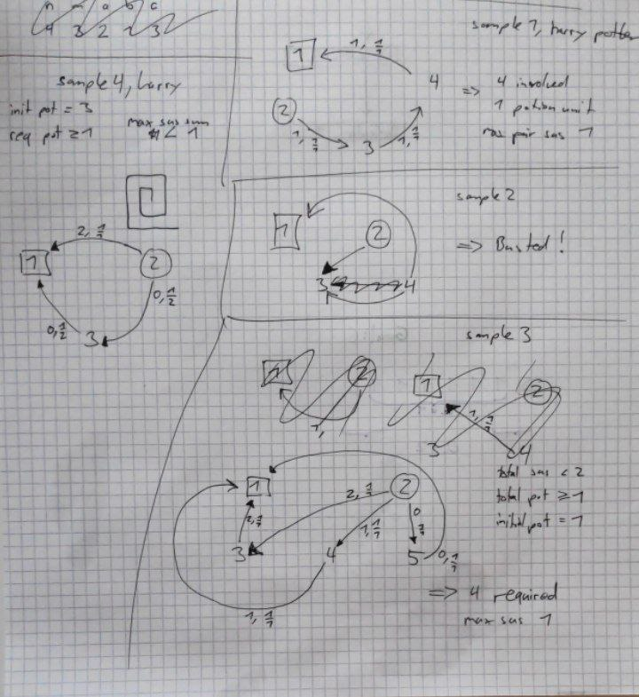

The last sample had solutions `3, 1` which does not make sense. ~~the second number, representing the largest pairwise suspicion should be $0$ in my opinion~~. However, here's how that makes sense: float numbers are allowed:

> Okay ich check de test case jetzt glaub. Wenn mer nur `k = 2` hetti faileds obviously wil zum 1 unit verabreiche machsch suspicion total of `2` und das isch zviel.
>
> Aber wenn nur d edges 2->3 und 3->1 benutze würsch brüchtisch meh potion als initially verfüegbar. Wil de harry hät am afang 3. `3 * 0.5 = 1.5,    1.5 * 0.5 = 0.75    < 1`.
>
> Also muess mer beidi Pfad benutze. Zersch mal so viel wie mir eus erlaube chönd durch de suspicious path. Sägemer `0.5` units, d.h. total suspicion of `1`. Grad na legal. Denn die restliche foif zweitel potion id edge 2->3 gäh, resultiert in `5/4` units. Denn vo 3->1 gäh, resultiert in `5/6`. In total also verabreicht: `5/6 + 3/6 = 8/6   > 1`.

#### Solving as LP

There are too many individual constraints as a flow. I spent a lot of time thinking about it as a flow or DP, but I think it's an LP problem.

The variables are one per interaction. That should work because we have a small number of people and interactions. Each $edge_{ab} \forall a,b$ represents how often the interaction was taken. 

Suspicion per interaction per unit is given, and denoted here as $sus_{ab}$.

* All edges are used at least $0$ times.

* The sum of incoming edges times their efficiency must be $\geq d$ for the Slughorn vertex.
* The sum of outgoing edges must be  $\leq a$ for the Harry vertex.
* The sum of each Vertex $v$'s outgoing edges must be smaller equals to the sum of each incoming edge times its efficiency.
* The sum of all $edge_{ab}\cdot sus_{ab}$, representing the total suspicion, must be $\leq c$
* We want to minimize the variable $max\_suspicion$. We do that by requiring that every edge suspicion in use is less than or equals to $max\_suspicion$.
  $sus_{ab} - max\_suspicion \leq 0$.
  And minimize $max\_suspicion$. But we only care about the edges in use...
  we could filter out unused edges by multiplying with $edge_{ab}$ ~~but that would cause problems if an edge was used a different number than never or once.~~
  And that's exactly how it's meant. They said we need to find the smallest integer $s$ that the suspicion raised by each pair is at most $s$. And since the suspicion caused scales with the amount of potion transported...
   $edge_{ab}\cdot sus_{ab} - max\_suspicion \leq 0$.

To choose the smallest $k$ that works, we could do a linear search or binary search using that LP multiple times.

For the first two test cases, we are told that the number will always be $k = n$ though. For the first test case, we also can assume that the largest edge suspiciousness $sus_{ab}$ in use is a known constant. So the task is only to find out whether a solution exists. For this, it's okay to not know how to model the $max\_suspicion$ optimization.

For the second test case, we add our $max\_suspicion$ constraint.

For the third and fourth test case, we perform binary or linear search on which friends we add. Not sure if it would be possible to solve that inside the LP.

## Exam Environment in HG

### Vim

Use `gvim`, otherwise copypaste does not work.

Highlight works after writing vimrc.

```vimrc
set mouse=a
set tabstop=4
set shiftwidth=4
set softtabstop=4
set expandtab
filetype plugin indent on
colo torte
```

### VSCode

download from the docs tools folder `vscode.cpptools-1.1.1-linux.vsix` and `algolabVS.sh`. grep the latter with `cat algolabVS.sh | "code --"` and execute the given command in the downloads folder.

Then make `algolabVS.sh` executable and run `./algolabVS.sh install`. Reopen terminal or  `source ~/.bashrc` and then move to project folder.

Per project, initialize with `algolabVS init`. Open VSCode with `code .`.

the `algolabVS init` already creates cmake and everything.

Debugging a different file: just paste the contents over, it's the easiest way.

place input data in `debug_test_data.txt`

To test things, do <kbd>Ctrl</kbd><kbd>shift</kbd><kbd>P</kbd> and then do the "run test task" "test"

### Keyboard

Windows key -> language and regions -> German Switzerland No Dead Keys.

### dot

Just works! If you managed to write a graph dot output, you can run

```bash
dot -Tsvg -omygraph.svg mygraph.dot && firefox mygraph.svg
```

## Licence

[CC-BY-SA 4.0](https://creativecommons.org/licenses/by-sa/4.0/legalcode)

And you are welcome to pull request for adding some missing infos and correcting mistakes I made!